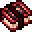

# Sanguinary Hunting Handbook

<small>[EnigmaticLegacy+](../../index.md) &rsaquo; [Items](../index.md) &rsaquo; [Books](index.md)</small>

| | |
|---|---|
| **ID** | `enigmaticlegacyplus:sanguinary_handbook` |
| **Category** | Books |
| **Rarity** | Rare |

## Description

When carried in inventory:

- ? Pet Attack Damage

- If equipped the Emblem of Bloodstained Valor

or Scroll of a Thousand Curses, Pets will

also receive corresponding effects based on you.

## What it does

It is made at the Crafting (cursed).

## Obtaining

### Recipes

**Crafting (cursed)** &rarr;  [Sanguinary Hunting Handbook](sanguinary-handbook.md)

| | | |
|---|---|---|
|  [Infernal Cinder](../generic/infernal-cinder.md) |  [Netherite Ingot](https://minecraft.wiki/w/Netherite_Ingot) |  [Infernal Cinder](../generic/infernal-cinder.md) |
|  [Ghast Tear](https://minecraft.wiki/w/Ghast_Tear) |  [Guide to Feral Hunt](hunter-guidebook.md) |  [Ghast Tear](https://minecraft.wiki/w/Ghast_Tear) |
|  [Dragon Breath](https://minecraft.wiki/w/Dragon_Breath) |  [Twisted Heart](../materials/twisted-heart.md) |  [Dragon Breath](https://minecraft.wiki/w/Dragon_Breath) |

## Config

Set in [`serverconfig/enigmaticlegacyplus-server.toml`](../../configs/serverconfig-enigmaticlegacyplus-server.md).

| Option | Default | Description |
|---|---|---|
| `sanguinaryHandbook.specialDamageBoost` | 0.25 (0 to 1) |  |

## Tags

`minecraft:bookshelf_books`
