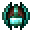

# Ethereal Forging Charm

<small>[EnigmaticLegacy+](../../index.md) &rsaquo; [Items](../index.md) &rsaquo; [Charms](index.md)</small>

| | |
|---|---|
| **ID** | `enigmaticlegacyplus:ethereal_forging_charm` |
| **Category** | Charms |
| **Rarity** | Uncommon |
| **Curio slot** | Charm |

## Description

Greatly reduce the durability consumption of items in inventory

and improves the attributes of the forging results.

Further enhances the effects of this item.

Enhancement: Increase the probability of reducing.

## Obtaining

### Recipes

**Crafting (shaped)** &rarr;  [Ethereal Forging Charm](ethereal-forging-charm.md)

| | | |
|---|---|---|
|   |  [The Forger's Gem](forger-gem.md) |   |
|  [Ender Rod](../generic/ender-rod.md) |  [Heart of the Earth](../materials/earth-heart.md) |  [Ender Rod](../generic/ender-rod.md) |
|  [Etherium Ingot](../materials/etherium-ingot.md) |  [Etherium Sledgehammer](../etherium/etherium-hammer.md) |  [Etherium Ingot](../materials/etherium-ingot.md) |

## Tags

`curios:charm`, `enigmaticlegacyplus:enchantable/etheric_resonance`
