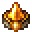
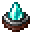

# Flawless Forging Gem

<small>[EnigmaticLegacy+](../../index.md) &rsaquo; [Items](../index.md) &rsaquo; [Charms](index.md)</small>

| | |
|---|---|
| **ID** | `enigmaticlegacyplus:forger_crystal` |
| **Category** | Charms |
| **Rarity** | Rare |
| **Fire resistant** | Yes |
| **Curio slot** | Charm |

## Description

+1 Charm Slot

Forging does not damage the anvil.

Half the experience required for forging.

Can use an undamaged identical tool to create an unbreakable item.

Unbreakable tools can be used as Totems of Undying.

## Obtaining

### Recipes

**Crafting (cursed)** &rarr;  [Flawless Forging Gem](forger-crystal.md)

| | | |
|---|---|---|
|   |  [Sacred Crystal](../generic/sacred-crystal.md) |   |
|  [Sacred Crystal](../generic/sacred-crystal.md) |  [The Forger's Gem](forger-gem.md) |  [Sacred Crystal](../generic/sacred-crystal.md) |
|  [Gold Ingot](https://minecraft.wiki/w/Gold_Ingot) |  [Totem Of Undying](https://minecraft.wiki/w/Totem_Of_Undying) |  [Gold Ingot](https://minecraft.wiki/w/Gold_Ingot) |

## Tags

`curios:charm`
