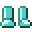

# Etherium Boots

<small>[EnigmaticLegacy+](../../index.md) &rsaquo; [Items](../index.md) &rsaquo; [Etherium](index.md)</small>

| | |
|---|---|
| **ID** | `enigmaticlegacyplus:etherium_boots` |
| **Category** | Etherium |
| **Fire resistant** | Yes |

## Description

Invisible while worn.

Enhancement: Get additional resistance when equipped in set.

## What it does

It is crafted.

## Obtaining

### Recipes

**Crafting (shaped)** &rarr;  [Etherium Boots](etherium-boots.md)

| | | |
|---|---|---|
|  [Etherium Ingot](../materials/etherium-ingot.md) |   |  [Etherium Ingot](../materials/etherium-ingot.md) |
|  [Etherium Ingot](../materials/etherium-ingot.md) |   |  [Etherium Ingot](../materials/etherium-ingot.md) |

## Config

Set in [`serverconfig/enigmaticlegacyplus-server.toml`](../../configs/serverconfig-enigmaticlegacyplus-server.md).

| Option | Default | Description |
|---|---|---|
| `etheriumShieldRenderLayer` | true |  |
| `etheriumShieldIcon` | true |  |
| `etheriumShieldIconOffset.OffsetX` | 0 (-1,024 to 1,024) |  |
| `etheriumShieldIconOffset.OffsetY` | 0 (-1,024 to 1,024) |  |

## Tags

`enigmaticlegacyplus:enchantable/etheric_resonance`, `minecraft:foot_armor`
