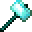

# Etherium Sledgehammer

<small>[EnigmaticLegacy+](../../index.md) &rsaquo; [Items](../index.md) &rsaquo; [Etherium](index.md)</small>

| | |
|---|---|
| **ID** | `enigmaticlegacyplus:etherium_hammer` |
| **Category** | Etherium |
| **Fire resistant** | Yes |

## Description

Breaks blocks in 3x3x1 area.

Hold Shift to suppress this effect.

Shift and Right-click to toggle this effect.

Enhancement: Can cause area damage.

## What it does

Used to make [Ethereal Forging Charm](../charms/ethereal-forging-charm.md). It is crafted.

## Obtaining

### Recipes

**Crafting (shaped)** &rarr;  [Etherium Sledgehammer](etherium-hammer.md)

| | | |
|---|---|---|
|  [Etherium Ingot](../materials/etherium-ingot.md) |  [Etherium Ingot](../materials/etherium-ingot.md) |  [Etherium Ingot](../materials/etherium-ingot.md) |
|  [Etherium Ingot](../materials/etherium-ingot.md) |  [Ender Rod](../generic/ender-rod.md) |  [Etherium Ingot](../materials/etherium-ingot.md) |
|   |  [Ender Rod](../generic/ender-rod.md) |   |

## Used in

[Ethereal Forging Charm](../charms/ethereal-forging-charm.md)

## Tags

`c:tools/mining_tool`, `enigmaticlegacyplus:enchantable/etheric_resonance`, `minecraft:enchantable/crossbow`, `minecraft:enchantable/durability`, `minecraft:enchantable/mining`, `minecraft:enchantable/mining_loot`, `minecraft:enchantable/weapon`
