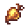

# Ichoroot

<small>[EnigmaticLegacy+](../../index.md) &rsaquo; [Items](../index.md) &rsaquo; [Food](index.md)</small>

| | |
|---|---|
| **ID** | `enigmaticlegacyplus:ichoroot` |
| **Category** | Food |

## What it does

Food. It is crafted.

## Obtaining

### Recipes

**Crafting (shaped)** &rarr;  [Ichoroot](ichoroot.md)

| | | |
|---|---|---|
|  [Beetroot](https://minecraft.wiki/w/Beetroot) |  [Ichor Droplet](../generic/ichor-droplet.md) |  [Beetroot](https://minecraft.wiki/w/Beetroot) |
|  [Beetroot](https://minecraft.wiki/w/Beetroot) |  [Ghast Tear](https://minecraft.wiki/w/Ghast_Tear) |  [Beetroot](https://minecraft.wiki/w/Beetroot) |
|  [Beetroot](https://minecraft.wiki/w/Beetroot) |  [Ichor Droplet](../generic/ichor-droplet.md) |  [Beetroot](https://minecraft.wiki/w/Beetroot) |

## Tags

`c:foods/vegetable`
