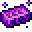

# Nefarious Ingot

<small>[EnigmaticLegacy+](../../index.md) &rsaquo; [Items](../index.md) &rsaquo; [Generic](index.md)</small>

| | |
|---|---|
| **ID** | `enigmaticlegacyplus:evil_ingot` |
| **Category** | Generic |
| **Rarity** | Uncommon |

## What it does

**Nefarious Ingot**, a cursed metal. It's the centerpiece of the Annihilating (abyssal) recipes.

Used to make [The Arrogance of Chaos](../tools/chaos-elytra.md). It is made at the Crafting (cursed).

## Obtaining

### Recipes

**Crafting (cursed)** &rarr;  [Nefarious Ingot](evil-ingot.md)

| | | |
|---|---|---|
|  [Ghast Tear](https://minecraft.wiki/w/Ghast_Tear) |  [Nefarious Essence](../materials/evil-essence.md) |  [Ghast Tear](https://minecraft.wiki/w/Ghast_Tear) |
|  [Nefarious Essence](../materials/evil-essence.md) |  [Netherite Ingot](https://minecraft.wiki/w/Netherite_Ingot) |  [Nefarious Essence](../materials/evil-essence.md) |
|  [Ghast Tear](https://minecraft.wiki/w/Ghast_Tear) |  [Nefarious Essence](../materials/evil-essence.md) |  [Ghast Tear](https://minecraft.wiki/w/Ghast_Tear) |

## Used in

[The Arrogance of Chaos](../tools/chaos-elytra.md)

## Tags

`c:ingots`
