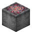

# Infernal Cinder

<small>[EnigmaticLegacy+](../../index.md) &rsaquo; [Items](../index.md) &rsaquo; [Generic](index.md)</small>

| | |
|---|---|
| **ID** | `enigmaticlegacyplus:infernal_cinder` |
| **Category** | Generic |

## What it does

Crafting material, used to make [Emblem of Bloodstained Valor](../charms/berserk-emblem.md), [Scroll of a Thousand Curses](../scrolls/cursed-scroll.md), [Unholy Stone](../misc/cursed-stone.md), [Axe of Executioner](../tools/execution-axe.md), [Exterminato](../food/exterminato.md) and 5 more. It is crafted, dropped by Blaze Addon and found in 1 kind of loot chest.

## Obtaining

### Recipes

**Crafting (shapeless)** &rarr;  [Infernal Cinder](infernal-cinder.md) x9

Ingredients:  [Sack of Infernal Cinder](../../blocks/infernal-cinder-sack.md)

### Loot

| Source | Count | Chance | Notes |
|---|---|---|---|
| Dropped by Blaze Addon | 1-3 | 15% | Looting increases the chance |
| Chest: Nether Simple Addon (`enigmaticlegacyplus:chests/nether_simple_addon`) | 0-2 | 6.2% |  |

## Used in

[Emblem of Bloodstained Valor](../charms/berserk-emblem.md), [Scroll of a Thousand Curses](../scrolls/cursed-scroll.md), [Unholy Stone](../misc/cursed-stone.md), [Axe of Executioner](../tools/execution-axe.md), [Exterminato](../food/exterminato.md), [Sack of Infernal Cinder](../../blocks/infernal-cinder-sack.md), [Ring of Quenching](../rings/infernal-ring.md), [Bulwark of Blazing Pride](../tools/infernal-shield.md), [Infernal Blazing Spear](../tools/infernal-spear.md), [Sanguinary Hunting Handbook](../books/sanguinary-handbook.md)

## Tags

`c:dusts`, `minecraft:enchantable/durability`, `minecraft:enchantable/vanishing`
