# Items

<small>[EnigmaticLegacy+](../index.md)</small>

EnigmaticLegacy+ adds **152** items.

| Group | Count |
|---|---|
| [Amulets](amulets/index.md) | 11 |
| [Books](books/index.md) | 12 |
| [Books &amp; Scrolls](books-scrolls/index.md) | 2 |
| [Charms](charms/index.md) | 9 |
| [Etherium](etherium/index.md) | 7 |
| [Food](food/index.md) | 5 |
| [Generic](generic/index.md) | 7 |
| [Legacy](legacy/index.md) | 6 |
| [Materials](materials/index.md) | 10 |
| [Op](op/index.md) | 2 |
| [Potions](potions/index.md) | 10 |
| [Rings](rings/index.md) | 13 |
| [Scrolls](scrolls/index.md) | 14 |
| [Spellstones](spellstones/index.md) | 16 |
| [Tools](tools/index.md) | 14 |
| [Misc](misc/index.md) | 8 |
| [Miscellaneous](miscellaneous/index.md) | 6 |

## Amulets

| | Name | ID |
|---|---|---|
| 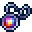 | [Amulet of Ascension](amulets/ascension-amulet.md) | `enigmaticlegacyplus:ascension_amulet` |
|  | [Amulet of Radiance](amulets/redemption-amulet.md) | `enigmaticlegacyplus:redemption_amulet` |
|  | [Enigmatic Amulet Aqua](amulets/enigmatic-amulet-aqua.md) | `enigmaticlegacyplus:enigmatic_amulet_aqua` |
| 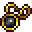 | [Enigmatic Amulet Black](amulets/enigmatic-amulet-black.md) | `enigmaticlegacyplus:enigmatic_amulet_black` |
| 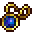 | [Enigmatic Amulet Blue](amulets/enigmatic-amulet-blue.md) | `enigmaticlegacyplus:enigmatic_amulet_blue` |
|  | [Enigmatic Amulet Green](amulets/enigmatic-amulet-green.md) | `enigmaticlegacyplus:enigmatic_amulet_green` |
| 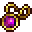 | [Enigmatic Amulet Magenta](amulets/enigmatic-amulet-magenta.md) | `enigmaticlegacyplus:enigmatic_amulet_magenta` |
| 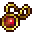 | [Enigmatic Amulet Red](amulets/enigmatic-amulet-red.md) | `enigmaticlegacyplus:enigmatic_amulet_red` |
| 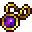 | [Enigmatic Amulet Violet](amulets/enigmatic-amulet-violet.md) | `enigmaticlegacyplus:enigmatic_amulet_violet` |
| 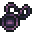 | [The Testament of Contempt](amulets/eldritch-amulet.md) | `enigmaticlegacyplus:eldritch_amulet` |
| 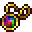 | [Unwitnessed Amulet](amulets/unwitnessed-amulet.md) | `enigmaticlegacyplus:unwitnessed_amulet` |

## Books

| | Name | ID |
|---|---|---|
|  | [Guide to Animal Companionship](books/animal-guidebook.md) | `enigmaticlegacyplus:animal_guidebook` |
|  | [Guide to Feral Hunt](books/hunter-guidebook.md) | `enigmaticlegacyplus:hunter_guidebook` |
|  | [Ode to Living Beings](books/ode-to-living.md) | `enigmaticlegacyplus:ode_to_living` |
|  | [Sanguinary Hunting Handbook](books/sanguinary-handbook.md) | `enigmaticlegacyplus:sanguinary_handbook` |
|  | [The Acknowledgment](books/the-acknowledgment.md) | `enigmaticlegacyplus:the_acknowledgment` |
| 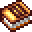 | [The Bless](books/the-bless.md) | `enigmaticlegacyplus:the_bless` |
| 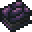 | [The Infinitum](books/the-infinitum.md) | `enigmaticlegacyplus:the_infinitum` |
|  | [The Twist](books/the-twist.md) | `enigmaticlegacyplus:the_twist` |
|  | [Tome of Devoured Malignancy](books/curse-transposer.md) | `enigmaticlegacyplus:curse_transposer` |
|  | [Tome of Divination](books/bless-amplifier.md) | `enigmaticlegacyplus:bless_amplifier` |
|  | [Tome of Hungering Knowledge](books/enchantment-transposer.md) | `enigmaticlegacyplus:enchantment_transposer` |
| 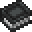 | [Tome of Void](books/void-tome.md) | `enigmaticlegacyplus:void_tome` |

## Books &amp; Scrolls

| | Name | ID |
|---|---|---|
|  | [Blank Scroll](books-scrolls/blank-scroll.md) | `enigmaticlegacyplus:blank_scroll` |
|  | [Darkest Scroll](books-scrolls/darkest-scroll.md) | `enigmaticlegacyplus:darkest_scroll` |

## Charms

| | Name | ID |
|---|---|---|
| 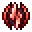 | [Charm of Hell Blade](charms/hell-blade-charm.md) | `enigmaticlegacyplus:hell_blade_charm` |
| 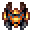 | [Charm of Scorched Sun](charms/scorched-charm.md) | `enigmaticlegacyplus:scorched_charm` |
|  | [Charm of Treasure Hunter](charms/mining-charm.md) | `enigmaticlegacyplus:mining_charm` |
| 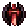 | [Emblem of Bloodstained Valor](charms/berserk-emblem.md) | `enigmaticlegacyplus:berserk_emblem` |
|  | [Emblem of Monster Slayer](charms/monster-charm.md) | `enigmaticlegacyplus:monster_charm` |
| 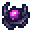 | [Enchanter's Pearl](charms/enchanter-pearl.md) | `enigmaticlegacyplus:enchanter_pearl` |
|  | [Ethereal Forging Charm](charms/ethereal-forging-charm.md) | `enigmaticlegacyplus:ethereal_forging_charm` |
|  | [Flawless Forging Gem](charms/forger-crystal.md) | `enigmaticlegacyplus:forger_crystal` |
|  | [The Forger's Gem](charms/forger-gem.md) | `enigmaticlegacyplus:forger_gem` |

## Etherium

| | Name | ID |
|---|---|---|
|  | [Etherium Boots](etherium/etherium-boots.md) | `enigmaticlegacyplus:etherium_boots` |
| 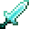 | [Etherium Broadsword](etherium/etherium-sword.md) | `enigmaticlegacyplus:etherium_sword` |
|  | [Etherium Cuirass](etherium/etherium-chestplate.md) | `enigmaticlegacyplus:etherium_chestplate` |
|  | [Etherium Greaves](etherium/etherium-leggings.md) | `enigmaticlegacyplus:etherium_leggings` |
| 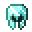 | [Etherium Helmet](etherium/etherium-helmet.md) | `enigmaticlegacyplus:etherium_helmet` |
|  | [Etherium Scythe](etherium/etherium-scythe.md) | `enigmaticlegacyplus:etherium_scythe` |
|  | [Etherium Sledgehammer](etherium/etherium-hammer.md) | `enigmaticlegacyplus:etherium_hammer` |

## Food

| | Name | ID |
|---|---|---|
|  | [Celestial Fruit](food/astral-fruit.md) | `enigmaticlegacyplus:astral_fruit` |
|  | [Enchanted Celestial Fruit](food/enchanted-astral-fruit.md) | `enigmaticlegacyplus:enchanted_astral_fruit` |
|  | [Exterminato](food/exterminato.md) | `enigmaticlegacyplus:exterminato` |
|  | [Ichoroot](food/ichoroot.md) | `enigmaticlegacyplus:ichoroot` |
|  | [The Forbidden Fruit](food/forbidden-fruit.md) | `enigmaticlegacyplus:forbidden_fruit` |

## Generic

| | Name | ID |
|---|---|---|
|  | [Astral Dust](generic/astral-dust.md) | `enigmaticlegacyplus:astral_dust` |
|  | [Ender Rod](generic/ender-rod.md) | `enigmaticlegacyplus:ender_rod` |
|  | [Ichor Droplet](generic/ichor-droplet.md) | `enigmaticlegacyplus:ichor_droplet` |
|  | [Infernal Cinder](generic/infernal-cinder.md) | `enigmaticlegacyplus:infernal_cinder` |
|  | [Nefarious Ingot](generic/evil-ingot.md) | `enigmaticlegacyplus:evil_ingot` |
|  | [Sacred Crystal](generic/sacred-crystal.md) | `enigmaticlegacyplus:sacred_crystal` |
|  | [Unknown](generic/unknown.md) | `enigmaticlegacyplus:unknown` |

## Legacy

| | Name | ID |
|---|---|---|
| 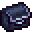 | [Antique Book Bag](legacy/antique-bag.md) | `enigmaticlegacyplus:antique_bag` |
| 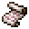 | [Blank Design Fragment](legacy/lore-fragment.md) | `enigmaticlegacyplus:lore_fragment` |
| 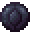 | [Enigmatic Eye](legacy/enigmatic-eye.md) | `enigmaticlegacyplus:enigmatic_eye` |
|  | [Keystone of The Oblivion](legacy/void-stone.md) | `enigmaticlegacyplus:void_stone` |
| 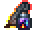 | [The Architect's Inkwell](legacy/lore-inscriber.md) | `enigmaticlegacyplus:lore_inscriber` |
|  | [Unholy Grail](legacy/unholy-grail.md) | `enigmaticlegacyplus:unholy_grail` |

## Materials

| | Name | ID |
|---|---|---|
|  | [Etherium Ingot](materials/etherium-ingot.md) | `enigmaticlegacyplus:etherium_ingot` |
|  | [Etherium Nugget](materials/etherium-nugget.md) | `enigmaticlegacyplus:etherium_nugget` |
|  | [Fragment of the Earth](materials/earth-heart-fragment.md) | `enigmaticlegacyplus:earth_heart_fragment` |
|  | [Heart of the Abyss](materials/abyssal-heart.md) | `enigmaticlegacyplus:abyssal_heart` |
|  | [Heart of the Earth](materials/earth-heart.md) | `enigmaticlegacyplus:earth_heart` |
|  | [Nefarious Essence](materials/evil-essence.md) | `enigmaticlegacyplus:evil_essence` |
|  | [Particle of Starlight](materials/starlight-particle.md) | `enigmaticlegacyplus:starlight_particle` |
|  | [Pure Heart](materials/pure-heart.md) | `enigmaticlegacyplus:pure_heart` |
|  | [Starlight Ingot](materials/starlight-ingot.md) | `enigmaticlegacyplus:starlight_ingot` |
|  | [Twisted Heart](materials/twisted-heart.md) | `enigmaticlegacyplus:twisted_heart` |

## Op

| | Name | ID |
|---|---|---|
|  | [The Judgement](op/the-judgement.md) | `enigmaticlegacyplus:the_judgement` |
|  | [The One Box](op/loot-generator.md) | `enigmaticlegacyplus:loot_generator` |

## Potions

| | Name | ID |
|---|---|---|
|  | [Bottle of Penance](potions/ichor-curse-bottle.md) | `enigmaticlegacyplus:ichor_curse_bottle` |
|  | [Enchanted Nectar of Ichor](potions/enchanted-ichor-bottle.md) | `enigmaticlegacyplus:enchanted_ichor_bottle` |
| 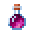 | [Mending Mixture](potions/mending-mixture.md) | `enigmaticlegacyplus:mending_mixture` |
|  | [Nectar of Ichor](potions/ichor-bottle.md) | `enigmaticlegacyplus:ichor_bottle` |
| 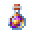 | [Potion of Purification](potions/bless-potion.md) | `enigmaticlegacyplus:bless_potion` |
|  | [Potion of Recall](potions/recall-potion.md) | `enigmaticlegacyplus:recall_potion` |
| 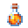 | [Potion of Redemption](potions/redemption-potion.md) | `enigmaticlegacyplus:redemption_potion` |
|  | [Potion of Twisted Mercy](potions/twisted-potion.md) | `enigmaticlegacyplus:twisted_potion` |
| 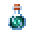 | [Potion of Wormhole](potions/wormhole-potion.md) | `enigmaticlegacyplus:wormhole_potion` |
| 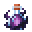 | [The Forbidden Juice](potions/forbidden-juice.md) | `enigmaticlegacyplus:forbidden_juice` |

## Rings

| | Name | ID |
|---|---|---|
|  | [Dislocation Ring](rings/dislocation-ring.md) | `enigmaticlegacyplus:dislocation_ring` |
|  | [Exquisite Ring](rings/golden-ring.md) | `enigmaticlegacyplus:golden_ring` |
|  | [Iron Ring](rings/iron-ring.md) | `enigmaticlegacyplus:iron_ring` |
|  | [Magic Quartz Ring](rings/quartz-ring.md) | `enigmaticlegacyplus:quartz_ring` |
|  | [Magnetic Ring](rings/magnet-ring.md) | `enigmaticlegacyplus:magnet_ring` |
|  | [Miner's Ring](rings/miner-ring.md) | `enigmaticlegacyplus:miner_ring` |
|  | [Promise of the Earth](rings/earth-promise.md) | `enigmaticlegacyplus:earth_promise` |
|  | [Ring of Ender](rings/ender-ring.md) | `enigmaticlegacyplus:ender_ring` |
|  | [Ring of Quenching](rings/infernal-ring.md) | `enigmaticlegacyplus:infernal_ring` |
|  | [Ring of Redemption](rings/redemption-ring.md) | `enigmaticlegacyplus:redemption_ring` |
|  | [Ring of Starlight](rings/starlight-ring.md) | `enigmaticlegacyplus:starlight_ring` |
|  | [Ring of the Seven Curses](rings/cursed-ring.md) | `enigmaticlegacyplus:cursed_ring` |
|  | [The Burden of Desolation](rings/desolation-ring.md) | `enigmaticlegacyplus:desolation_ring` |

## Scrolls

| | Name | ID |
|---|---|---|
|  | [Gift of the Heaven](scrolls/heaven-scroll.md) | `enigmaticlegacyplus:heaven_scroll` |
| 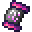 | [Grace of the Creator](scrolls/fabulous-scroll.md) | `enigmaticlegacyplus:fabulous_scroll` |
|  | [Pact of Dark Night](scrolls/night-scroll.md) | `enigmaticlegacyplus:night_scroll` |
|  | [Pact of Infinite Avarice](scrolls/avarice-scroll.md) | `enigmaticlegacyplus:avarice_scroll` |
|  | [Scroll of a Thousand Curses](scrolls/cursed-scroll.md) | `enigmaticlegacyplus:cursed_scroll` |
| 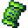 | [Scroll of Ageless Wisdom](scrolls/xp-scroll.md) | `enigmaticlegacyplus:xp_scroll` |
|  | [Scroll of Explorer](scrolls/explorer-scroll.md) | `enigmaticlegacyplus:explorer_scroll` |
| 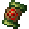 | [Scroll of Hunter](scrolls/hunter-scroll.md) | `enigmaticlegacyplus:hunter_scroll` |
|  | [Scroll of Ignorance Curse](scrolls/cursed-xp-scroll.md) | `enigmaticlegacyplus:cursed_xp_scroll` |
|  | [Scroll of Postmortal Recall](scrolls/escape-scroll.md) | `enigmaticlegacyplus:escape_scroll` |
| 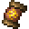 | [Scroll of Survivor](scrolls/survivor-scroll.md) | `enigmaticlegacyplus:survivor_scroll` |
| 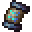 | [Scroll of Thunder Embrace](scrolls/thunder-scroll.md) | `enigmaticlegacyplus:thunder_scroll` |
| 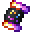 | [The Architect's Favor](scrolls/cosmic-scroll.md) | `enigmaticlegacyplus:cosmic_scroll` |
|  | [The Curse of Violence](scrolls/violence-scroll.md) | `enigmaticlegacyplus:violence_scroll` |

## Spellstones

| | Name | ID |
|---|---|---|
|  | [Angel's Blessing](spellstones/angel-blessing.md) | `enigmaticlegacyplus:angel_blessing` |
|  | [Blazing Core](spellstones/blazing-core.md) | `enigmaticlegacyplus:blazing_core` |
|  | [Etherium Core](spellstones/etherium-core.md) | `enigmaticlegacyplus:etherium_core` |
|  | [Eye of the Nebula](spellstones/eye-of-nebula.md) | `enigmaticlegacyplus:eye_of_nebula` |
|  | [Forgotten Ice Crystal](spellstones/forgotten-ice.md) | `enigmaticlegacyplus:forgotten_ice` |
|  | [Heart of Creation](spellstones/creation-heart.md) | `enigmaticlegacyplus:creation_heart` |
|  | [Heart of the Golem](spellstones/golem-heart.md) | `enigmaticlegacyplus:golem_heart` |
|  | [Lost Engine](spellstones/lost-engine.md) | `enigmaticlegacyplus:lost_engine` |
|  | [Non-Euclidean Cube](spellstones/the-cube.md) | `enigmaticlegacyplus:the_cube` |
|  | [Pearl of the Void](spellstones/void-pearl.md) | `enigmaticlegacyplus:void_pearl` |
|  | [Resonator of Spell](spellstones/spellstone-sword.md) | `enigmaticlegacyplus:spellstone_sword` |
|  | [Revival Leaves](spellstones/revival-leaf.md) | `enigmaticlegacyplus:revival_leaf` |
|  | [Soul Lantern of Illusion](spellstones/illusion-lantern.md) | `enigmaticlegacyplus:illusion_lantern` |
|  | [Spellcore](spellstones/spellcore.md) | `enigmaticlegacyplus:spellcore` |
|  | [Spelltuner](spellstones/spelltuner.md) | `enigmaticlegacyplus:spelltuner` |
|  | [Will of the Ocean](spellstones/ocean-stone.md) | `enigmaticlegacyplus:ocean_stone` |

## Tools

| | Name | ID |
|---|---|---|
| 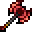 | [Axe of Executioner](tools/execution-axe.md) | `enigmaticlegacyplus:execution_axe` |
|  | [Bulwark of Blazing Pride](tools/infernal-shield.md) | `enigmaticlegacyplus:infernal_shield` |
|  | [Decision of Annihilation](tools/annihilating-sword.md) | `enigmaticlegacyplus:annihilating_sword` |
|  | [Dragon Breath Bow](tools/dragon-breath-bow.md) | `enigmaticlegacyplus:dragon_breath_bow` |
|  | [Ichor Spear](tools/ichor-spear.md) | `enigmaticlegacyplus:ichor_spear` |
|  | [Infernal Blazing Spear](tools/infernal-spear.md) | `enigmaticlegacyplus:infernal_spear` |
| 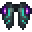 | [Majestic Elytra](tools/majestic-elytra.md) | `enigmaticlegacyplus:majestic_elytra` |
|  | [Pseudo-Sacred Chalice](tools/sacred-chalice.md) | `enigmaticlegacyplus:sacred_chalice` |
|  | [Starlight Bucket](tools/starlight-bucket.md) | `enigmaticlegacyplus:starlight_bucket` |
| 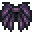 | [The Arrogance of Chaos](tools/chaos-elytra.md) | `enigmaticlegacyplus:chaos_elytra` |
|  | [The Ender Slayer](tools/ender-slayer.md) | `enigmaticlegacyplus:ender_slayer` |
|  | [Totem of Malice](tools/totem-of-malice.md) | `enigmaticlegacyplus:totem_of_malice` |
| 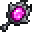 | [Twisted Mirror](tools/twisted-mirror.md) | `enigmaticlegacyplus:twisted_mirror` |
|  | [Wayfinder of the Damned](tools/soul-compass.md) | `enigmaticlegacyplus:soul_compass` |

## Misc

| | Name | ID |
|---|---|---|
|  | [Astral Pearl](misc/starlight-pearl.md) | `enigmaticlegacyplus:starlight_pearl` |
|  | [Essence of Raging Life](misc/infinimeal.md) | `enigmaticlegacyplus:infinimeal` |
| 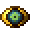 | [Extradimensional Eye](misc/extradimensional-eye.md) | `enigmaticlegacyplus:extradimensional_eye` |
|  | [Extradimensional Vessel](misc/storage-crystal.md) | `enigmaticlegacyplus:storage_crystal` |
| 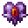 | [Heart of the Guardian](misc/guardian-heart.md) | `enigmaticlegacyplus:guardian_heart` |
|  | [Holy Stone](misc/bless-stone.md) | `enigmaticlegacyplus:bless_stone` |
|  | [Soul Crystal](misc/soul-crystal.md) | `enigmaticlegacyplus:soul_crystal` |
|  | [Unholy Stone](misc/cursed-stone.md) | `enigmaticlegacyplus:cursed_stone` |

## Miscellaneous

| | Name | ID |
|---|---|---|
|  | [Heart of the Cosmos](miscellaneous/cosmic-heart.md) | `enigmaticlegacyplus:cosmic_heart` |
| 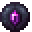 | [Inscrutable Eye](miscellaneous/enigmatic-eye-active.md) | `enigmaticlegacyplus:enigmatic_eye_active` |
| 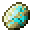 | [Raw Etherium](miscellaneous/raw-etherium.md) | `enigmaticlegacyplus:raw_etherium` |
|  | [Spellstone Debris](miscellaneous/spellstone-debris.md) | `enigmaticlegacyplus:spellstone_debris` |
| 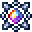 | [Starlight Core](miscellaneous/etherium-core-active.md) | `enigmaticlegacyplus:etherium_core_active` |
| 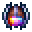 | [Starlight Forging Charm](miscellaneous/ethereal-forging-charm-active.md) | `enigmaticlegacyplus:ethereal_forging_charm_active` |
