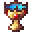

# Unholy Grail

<small>[EnigmaticLegacy+](../../index.md) &rsaquo; [Items](../index.md) &rsaquo; [Legacy](index.md)</small>

| | |
|---|---|
| **ID** | `enigmaticlegacyplus:unholy_grail` |
| **Category** | Legacy |
| **Rarity** | Uncommon |
| **Fire resistant** | Yes |

## Description

You'd better not be drinking from it...

## What it does

It is found in 1 kind of loot chest.

## Obtaining

### Loot

| Source | Count | Chance | Notes |
|---|---|---|---|
| Chest: Overworld Simple Addon (`enigmaticlegacyplus:chests/overworld_simple_addon`) | 1 | 2.3% |  |
