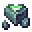
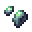

# Heart of the Earth

<small>[EnigmaticLegacy+](../../index.md) &rsaquo; [Items](../index.md) &rsaquo; [Materials](index.md)</small>

| | |
|---|---|
| **ID** | `enigmaticlegacyplus:earth_heart` |
| **Category** | Materials |
| **Rarity** | Uncommon |

## Description

Slightly tainted by cursed one's presence.

## Obtaining

### Recipes

**Crafting (shapeless)** &rarr;  [Heart of the Earth](earth-heart.md)

Ingredients:  [Fragment of the Earth](earth-heart-fragment.md),  [Fragment of the Earth](earth-heart-fragment.md),  [Fragment of the Earth](earth-heart-fragment.md),  [Fragment of the Earth](earth-heart-fragment.md),  [Fragment of the Earth](earth-heart-fragment.md),  [Fragment of the Earth](earth-heart-fragment.md),  [Fragment of the Earth](earth-heart-fragment.md),  [Fragment of the Earth](earth-heart-fragment.md)

### Loot

| Source | Count | Chance | Notes |
|---|---|---|---|
| Chest: Overworld Simple Addon (`enigmaticlegacyplus:chests/overworld_simple_addon`) | 1 | 7.8% |  |
| Chest: Treasure (`enigmaticlegacyplus:chests/spellstone_hut/treasure`) | 1 | 5.0% |  |

## Used in

[Ethereal Forging Charm](../charms/ethereal-forging-charm.md), [Essence of Raging Life](../misc/infinimeal.md), [Charm of Treasure Hunter](../charms/mining-charm.md), [Ode to Living Beings](../books/ode-to-living.md), [Pure Heart](pure-heart.md), [Twisted Heart](twisted-heart.md), [Etherium Core](../spellstones/etherium-core.md)
