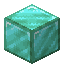

# Etherium Ingot

<small>[EnigmaticLegacy+](../../index.md) &rsaquo; [Items](../index.md) &rsaquo; [Materials](index.md)</small>

| | |
|---|---|
| **ID** | `enigmaticlegacyplus:etherium_ingot` |
| **Category** | Materials |

## Obtaining

### Recipes

**Blasting** &rarr;  [Etherium Ingot](etherium-ingot.md)

Ingredients:  [Raw Etherium](../miscellaneous/raw-etherium.md)

**Crafting (shapeless)** &rarr;  [Etherium Ingot](etherium-ingot.md) x9

Ingredients:  [Etherium Block](../../blocks/etherium-block.md)

**Crafting (shaped)** &rarr;  [Etherium Ingot](etherium-ingot.md)

| | | |
|---|---|---|
|  [Etherium Nugget](etherium-nugget.md) |  [Etherium Nugget](etherium-nugget.md) |  [Etherium Nugget](etherium-nugget.md) |
|  [Etherium Nugget](etherium-nugget.md) |  [Etherium Nugget](etherium-nugget.md) |  [Etherium Nugget](etherium-nugget.md) |
|  [Etherium Nugget](etherium-nugget.md) |  [Etherium Nugget](etherium-nugget.md) |  [Etherium Nugget](etherium-nugget.md) |

### Loot

| Source | Count | Chance | Notes |
|---|---|---|---|
| Chest: End Simple Addon (`enigmaticlegacyplus:chests/end_simple_addon`) | 0-2 | 9.4% |  |

## Used in

[Dimensional Anchor](../../blocks/dimensional-anchor.md), [Dragon Breath Bow](../tools/dragon-breath-bow.md), [Ethereal Forging Charm](../charms/ethereal-forging-charm.md), [Ethereal Lantern](../../blocks/ethereal-lantern.md), [Etherium Block](../../blocks/etherium-block.md), [Etherium Boots](../etherium/etherium-boots.md), [Etherium Cuirass](../etherium/etherium-chestplate.md), [Etherium Sledgehammer](../etherium/etherium-hammer.md), [Etherium Helmet](../etherium/etherium-helmet.md), [Etherium Greaves](../etherium/etherium-leggings.md), [Etherium Nugget](etherium-nugget.md), [Etherium Scythe](../etherium/etherium-scythe.md), [Etherium Broadsword](../etherium/etherium-sword.md), [Grace of the Creator](../scrolls/fabulous-scroll.md), [Majestic Elytra](../tools/majestic-elytra.md), [Starlight Ingot](starlight-ingot.md)

## Tags

`c:ingots`
