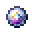

# Astral Pearl

<small>[EnigmaticLegacy+](../../index.md) &rsaquo; [Items](../index.md) &rsaquo; [Misc](index.md)</small>

| | |
|---|---|
| **ID** | `enigmaticlegacyplus:starlight_pearl` |
| **Category** | Misc |
| **Fire resistant** | Yes |

## Description

Right-click on certain items to upgrade them.

## Obtaining

### Recipes

**Crafting (shaped)** &rarr;  [Astral Pearl](starlight-pearl.md)

| | | |
|---|---|---|
|  [Particle of Starlight](../materials/starlight-particle.md) |  [Astral Dust](../generic/astral-dust.md) |  [Particle of Starlight](../materials/starlight-particle.md) |
|  [Starlight Ingot](../materials/starlight-ingot.md) |  [Ender Pearl](https://minecraft.wiki/w/Ender_Pearl) |  [Starlight Ingot](../materials/starlight-ingot.md) |
|  [Particle of Starlight](../materials/starlight-particle.md) |  [Astral Dust](../generic/astral-dust.md) |  [Particle of Starlight](../materials/starlight-particle.md) |

