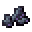

# Spellstone Debris

<small>[EnigmaticLegacy+](../../index.md) &rsaquo; [Items](../index.md) &rsaquo; [Miscellaneous](index.md)</small>

| | |
|---|---|
| **ID** | `enigmaticlegacyplus:spellstone_debris` |
| **Category** | Miscellaneous |

## What it does

Crafting material, used to make [Resonator of Spell](../spellstones/spellstone-sword.md) and [Spelltuner](../spellstones/spelltuner.md). It is found in 11 kinds of loot chest.

## Obtaining

### Loot

| Source | Count | Chance | Notes |
|---|---|---|---|
| Chest: Treasure (`enigmaticlegacyplus:chests/spellstone_hut/treasure`) | 1-5 | 60% |  |
| Chest: Treasure (`enigmaticlegacyplus:chests/spellstone_hut/treasure`) | 1-3 | 40% |  |
| Chest: Forgotten Ice Addon (`enigmaticlegacyplus:chests/forgotten_ice_addon`) | 0-3 | 12% |  |
| Chest: Angel Blessing Addon (`enigmaticlegacyplus:chests/angel_blessing_addon`) | 0-3 | 8.8% |  |
| Chest: Revival Leaf Addon (`enigmaticlegacyplus:chests/revival_leaf_addon`) | 0-3 | 5.9% |  |
| Chest: Ocean Stone Addon (`enigmaticlegacyplus:chests/ocean_stone_addon`) | 0-3 | 5.2% |  |
| Chest: Golem Heart Addon (`enigmaticlegacyplus:chests/golem_heart_addon`) | 0-3 | 4.8% |  |
| Chest: Lost Engine Addon (`enigmaticlegacyplus:chests/lost_engine_addon`) | 0-3 | 3.9% |  |
| Chest: Eye Of Nebula Addon (`enigmaticlegacyplus:chests/eye_of_nebula_addon`) | 0-3 | 3.6% |  |
| Chest: Blazing Core Addon (`enigmaticlegacyplus:chests/blazing_core_addon`) | 0-3 | 3.2% |  |
| Chest: Void Pearl Addon (`enigmaticlegacyplus:chests/void_pearl_addon`) | 0-3 | 3.0% |  |

## Used in

[Resonator of Spell](../spellstones/spellstone-sword.md), [Spelltuner](../spellstones/spelltuner.md)
