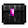

# The One Box

<small>[EnigmaticLegacy+](../../index.md) &rsaquo; [Items](../index.md) &rsaquo; [Op](index.md)</small>

| | |
|---|---|
| **ID** | `enigmaticlegacyplus:loot_generator` |
| **Category** | Op |
| **Rarity** | Epic |

## Description

Press Right-Click or Shift+Right-Click to

cycle back and forth the loot tables list.

Press Shift+Right-Click on the top of a chest

to fill it with randomly generated loot from

selected loot table, or on the bottom to print

estimated loot generation results in 32768

instances to latest.log file.

Clicking on other sides of a chest will instead

obliterate anything stored within.

Hold Shift to see details.

Current Loot Table:
