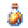

# Nectar of Ichor

<small>[EnigmaticLegacy+](../../index.md) &rsaquo; [Items](../index.md) &rsaquo; [Potions](index.md)</small>

| | |
|---|---|
| **ID** | `enigmaticlegacyplus:ichor_bottle` |
| **Category** | Potions |
| **Rarity** | Rare |

## Description

To contempt the gods, one must know them...

Consume to obtain +1 Charm Slot permanently.

## Obtaining

### Loot

| Source | Count | Chance | Notes |
|---|---|---|---|
| Chest: Overworld Simple Addon (`enigmaticlegacyplus:chests/overworld_simple_addon`) | 1 | 8.6% |  |

## Tags

`c:drinks/magic`
