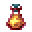

# Bottle of Penance

<small>[EnigmaticLegacy+](../../index.md) &rsaquo; [Items](../index.md) &rsaquo; [Potions](index.md)</small>

| | |
|---|---|
| **ID** | `enigmaticlegacyplus:ichor_curse_bottle` |
| **Category** | Potions |
| **Rarity** | Rare |

## What it does

**Bottle of Penance.** Drinking it gives the Ichor Curse for 32 minutes. A blessed player (one bearing the Ring of Redemption) also gets Absorption V for 2 minutes. It's both cursed and blessed.

Edible, but it doesn't fill you up. Eating it gives [Curse of Penance](../../effects/ichor-curse.md) for 1,920 s, [Ichor Corrosion](../../effects/ichor-corrosion.md) for 60 s (80% chance), [Ichor Corrosion](../../effects/ichor-corrosion.md) for 60 s (40% chance) and [Ichor Corrosion](../../effects/ichor-corrosion.md) for 60 s (20% chance). It is found in 1 kind of loot chest.

## Obtaining

### Loot

| Source | Count | Chance | Notes |
|---|---|---|---|
| Chest: Nether Simple Addon (`enigmaticlegacyplus:chests/nether_simple_addon`) | 1 | 9.4% |  |

## Tags

`c:drinks/magic`
