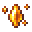

# Promise of the Earth

<small>[EnigmaticLegacy+](../../index.md) &rsaquo; [Items](../index.md) &rsaquo; [Rings](index.md)</small>

| | |
|---|---|
| **ID** | `enigmaticlegacyplus:earth_promise` |
| **Category** | Rings |
| **Rarity** | Rare |
| **Curio slot** | Ring |

## Description

Alteration of the ?:

First Curse

- Reduce the effect of the First Curse by 25%.

When receiving damage worth 80% of your

health, block the attack and cooldown for ? sec.

## What it does

It is made at the Crafting (cursed).

## Obtaining

### Recipes

**Crafting (cursed)** &rarr;  [Promise of the Earth](earth-promise.md)

| | | |
|---|---|---|
|  [Pure Heart](../materials/pure-heart.md) |  [Golden Apple](https://minecraft.wiki/w/Golden_Apple) |  [Pure Heart](../materials/pure-heart.md) |
|  [Sacred Crystal](../generic/sacred-crystal.md) |  [Exquisite Ring](golden-ring.md) |  [Sacred Crystal](../generic/sacred-crystal.md) |
|  [Enchanted Golden Apple](https://minecraft.wiki/w/Enchanted_Golden_Apple) |  [Charm of Treasure Hunter](../charms/mining-charm.md) |  [Enchanted Golden Apple](https://minecraft.wiki/w/Enchanted_Golden_Apple) |

## Config

Set in [`serverconfig/enigmaticlegacyplus-server.toml`](../../configs/serverconfig-enigmaticlegacyplus-server.md).

| Option | Default | Description |
|---|---|---|
| `earthPromise.cooldown` | 1,000 (200 to 2,000) |  |
| `earthPromise.firstCurseModifier` | 25 (0 to 100) |  |
| `earthPromise.healthThreshold` | 80 (0 to 100) |  |

## Tags

`curios:ring`
