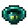
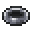
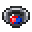
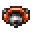
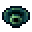
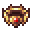
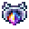
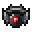
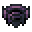

# Rings

<small>[EnigmaticLegacy+](../../index.md) &rsaquo; [Items](../index.md)</small>

| | Name | Description |
|---|---|---|
|  | [Dislocation Ring](dislocation-ring.md) | Instantly collects any dropped items |
|  | [Exquisite Ring](golden-ring.md) | Exquisite Ring, a ring (Curios slot) that gives +1 Luck, keeps piglins neutral and counts as gold to them. |
|  | [Iron Ring](iron-ring.md) | A plain ring (Curios slot) that gives +1 armor. |
|  | [Magic Quartz Ring](quartz-ring.md) | Magic Quartz Ring (Curios slot): +2 armor, +1.5 Luck and % less magic damage. |
|  | [Magnetic Ring](magnet-ring.md) | Attracts items within ? blocks radius. |
|  | [Miner's Ring](miner-ring.md) | Consumes fuel bar to smelt items as blast furnace. |
|  | [Promise of the Earth](earth-promise.md) | Alteration of the ?: |
|  | [Ring of Ender](ender-ring.md) | Allows you to remotely access your |
|  | [Ring of Quenching](infernal-ring.md) | When the Blazing Might effect is removed, |
|  | [Ring of Redemption](redemption-ring.md) | For those who have experienced torment, |
|  | [Ring of Starlight](starlight-ring.md) | Increase the spawn frequency of Starlight Meteors. |
|  | [Ring of the Seven Curses](cursed-ring.md) | Seven curses will befall whoever bears it: |
|  | [The Burden of Desolation](desolation-ring.md) | Prevents any dropping from slain mob. |
