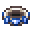

# Magic Quartz Ring

<small>[EnigmaticLegacy+](../../index.md) &rsaquo; [Items](../index.md) &rsaquo; [Rings](index.md)</small>

| | |
|---|---|
| **ID** | `enigmaticlegacyplus:quartz_ring` |
| **Category** | Rings |
| **Curio slot** | Ring |

## Obtaining

### Recipes

**Crafting (shaped)** &rarr;  [Magic Quartz Ring](quartz-ring.md)

| | | |
|---|---|---|
|  [Quartz](https://minecraft.wiki/w/Quartz) |  [Lapis Lazuli](https://minecraft.wiki/w/Lapis_Lazuli) |  [Quartz](https://minecraft.wiki/w/Quartz) |
|  [Quartz](https://minecraft.wiki/w/Quartz) |  [Exquisite Ring](golden-ring.md) |  [Quartz](https://minecraft.wiki/w/Quartz) |
|  [Lapis Lazuli](https://minecraft.wiki/w/Lapis_Lazuli) |  [Ghast Tear](https://minecraft.wiki/w/Ghast_Tear) |  [Lapis Lazuli](https://minecraft.wiki/w/Lapis_Lazuli) |

## Used in

[The Forger's Gem](../charms/forger-gem.md), [Ring of Starlight](starlight-ring.md), [Angel's Blessing](../spellstones/angel-blessing.md)

## Config

Set in [`serverconfig/enigmaticlegacyplus-server.toml`](../../configs/serverconfig-enigmaticlegacyplus-server.md).

| Option | Default | Description |
|---|---|---|
| `quartzRing.specialDamageResistance` | 25 (0 to 100) |  |

## Tags

`curios:ring`
