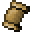

# Gift of the Heaven

<small>[EnigmaticLegacy+](../../index.md) &rsaquo; [Items](../index.md) &rsaquo; [Scrolls](index.md)</small>

| | |
|---|---|
| **ID** | `enigmaticlegacyplus:heaven_scroll` |
| **Category** | Scrolls |
| **Rarity** | Rare |
| **Curio slot** | Scroll |

## Description

Provides you an ability to fly within the range

of an active Beacon, at the cost of slowly

consuming your experience.

Compensates mining speed penalty when flying.

## What it does

Used to make [Grace of the Creator](fabulous-scroll.md). It is crafted.

## Obtaining

### Recipes

**Crafting (shaped)** &rarr;  [Gift of the Heaven](heaven-scroll.md)

| | | |
|---|---|---|
|  [Gold Ingot](https://minecraft.wiki/w/Gold_Ingot) |  [Nether Star](https://minecraft.wiki/w/Nether_Star) |  [Gold Ingot](https://minecraft.wiki/w/Gold_Ingot) |
|  [Ink Sac](https://minecraft.wiki/w/Ink_Sac) |  [Blank Scroll](../books-scrolls/blank-scroll.md) |  [Feather](https://minecraft.wiki/w/Feather) |
|  [Lapis Lazuli](https://minecraft.wiki/w/Lapis_Lazuli) |  [Angel's Blessing](../spellstones/angel-blessing.md) |  [Lapis Lazuli](https://minecraft.wiki/w/Lapis_Lazuli) |

## Used in

[Grace of the Creator](fabulous-scroll.md)

## Tags

`curios:scroll`
