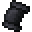

# Pact of Dark Night

<small>[EnigmaticLegacy+](../../index.md) &rsaquo; [Items](../index.md) &rsaquo; [Scrolls](index.md)</small>

| | |
|---|---|
| **ID** | `enigmaticlegacyplus:night_scroll` |
| **Category** | Scrolls |
| **Rarity** | Rare |
| **Curio slot** | Scroll |

## Description

Phantoms  will not spawn naturally in your proximity.

Provide bonuses based on the brightness.

When equipped as Arcane Scroll:

+? Attack Damage

+? Damage Resistance

+? Lifesteal

## Obtaining

### Recipes

**Crafting (cursed)** &rarr;  [Pact of Dark Night](night-scroll.md)

| | | |
|---|---|---|
|  [Phantom Membrane](https://minecraft.wiki/w/Phantom_Membrane) |  [Twisted Heart](../materials/twisted-heart.md) |  [Phantom Membrane](https://minecraft.wiki/w/Phantom_Membrane) |
|  [Wither Rose](https://minecraft.wiki/w/Wither_Rose) |  [Darkest Scroll](../books-scrolls/darkest-scroll.md) |  [Feather](https://minecraft.wiki/w/Feather) |
|  [Phantom Membrane](https://minecraft.wiki/w/Phantom_Membrane) |  [Ender Eye](https://minecraft.wiki/w/Ender_Eye) |  [Phantom Membrane](https://minecraft.wiki/w/Phantom_Membrane) |

## Config

Set in [`serverconfig/enigmaticlegacyplus-server.toml`](../../configs/serverconfig-enigmaticlegacyplus-server.md).

| Option | Default | Description |
|---|---|---|
| `nightScroll.effectiveRange` | 16 (1 to 64) |  |
| `nightScroll.attackDamage` | 20 (0 to 100) |  |
| `nightScroll.damageResistance` | 16 (0 to 100) |  |
| `nightScroll.lifeSteal` | 8 (0 to 100) |  |

## Tags

`curios:scroll`
