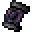
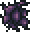
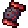
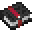

# The Curse of Violence

<small>[EnigmaticLegacy+](../../index.md) &rsaquo; [Items](../index.md) &rsaquo; [Scrolls](index.md)</small>

| | |
|---|---|
| **ID** | `enigmaticlegacyplus:violence_scroll` |
| **Category** | Scrolls |
| **Rarity** | Epic |
| **Curio slot** | Scroll |

## Description

Absorbed Curses:

Reduce the duration of invincibility caused by attacks.

Gain Curse of Mania effect continuously in combat.

Right-click on other items in the inventory to absorb their curse enchantments.

Unique Curses Absorbed: ?

- ? Attack Speed

- ? Entity Reach

- ? Knockback Resistance

Abyss Boost:

- Provides a brief damage immunity upon attacking.

An accursed being is one rarely worth creating an enemy of.

Whether their curse be one of luck, of pain, of destitution -

they have lost much of what they had attained, and easily

fight without care toward their own wellbeing.

Hold Alt to see Absorbed Curses.

## What it does

It is made at the Crafting (cursed).

## Obtaining

### Recipes

**Crafting (cursed)** &rarr;  [The Curse of Violence](violence-scroll.md)

| | | |
|---|---|---|
|  [Heart of the Cosmos](../miscellaneous/cosmic-heart.md) |  [Heart of the Abyss](../materials/abyssal-heart.md) |  [Heart of the Cosmos](../miscellaneous/cosmic-heart.md) |
|  [Nefarious Essence](../materials/evil-essence.md) |  [Scroll of a Thousand Curses](cursed-scroll.md) |  [Nefarious Essence](../materials/evil-essence.md) |
|  [Twisted Heart](../materials/twisted-heart.md) |  [Tome of Devoured Malignancy](../books/curse-transposer.md) |  [Twisted Heart](../materials/twisted-heart.md) |

## Config

Set in [`serverconfig/enigmaticlegacyplus-server.toml`](../../configs/serverconfig-enigmaticlegacyplus-server.md).

| Option | Default | Description |
|---|---|---|
| `specialVisualEffects` | true |  |
| `violenceScroll.attackSpeed` | 4 (0 to 10) |  |
| `violenceScroll.entityReach` | 3 (0 to 20) |  |
| `violenceScroll.knockbackResistanceBoost` | 2 (0 to 10) |  |

## Tags

`curios:scroll`, `enigmaticlegacyplus:abyssal_items`
