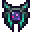

# Eye of the Nebula

<small>[EnigmaticLegacy+](../../index.md) &rsaquo; [Items](../index.md) &rsaquo; [Spellstones](index.md)</small>

| | |
|---|---|
| **ID** | `enigmaticlegacyplus:eye_of_nebula` |
| **Category** | Spellstones |
| **Rarity** | Rare |

## Description

Active ability:

- Teleports you behind creature you are looking at.

Сooldown: ? seconds

Passive abilities:

- 40% Magic Damage Increase

- 65% Magic Damage Resistance

- 15% Chance to teleport away from any attack.

- After using an active ability, your next attack is

empowered and deals +150% Damage.

- Immunity to damage from using Ender Pearls.

- When in water, you are vulnerable to ANY damage.

Hold Shift to see details.

## What it does

Used to make [Dimensional Anchor](../../blocks/dimensional-anchor.md), [Majestic Elytra](../tools/majestic-elytra.md) and [Non-Euclidean Cube](the-cube.md). It is made at the Spellstone Table and found in 1 kind of loot chest.

## Obtaining

### Recipes

**Spellstone Table** &rarr;  [Eye of the Nebula](eye-of-nebula.md)

Ingredients:  [Ender Rod](../generic/ender-rod.md),  [Chorus Fruit](https://minecraft.wiki/w/Chorus_Fruit),  [End Stone Bricks](https://minecraft.wiki/w/End_Stone_Bricks),  [Ender Eye](https://minecraft.wiki/w/Ender_Eye),  [End Stone Bricks](https://minecraft.wiki/w/End_Stone_Bricks),  [Chorus Fruit](https://minecraft.wiki/w/Chorus_Fruit),  [Ender Rod](../generic/ender-rod.md)

Details: debris count 7

### Loot

| Source | Count | Chance | Notes |
|---|---|---|---|
| Chest: Eye Of Nebula Addon (`enigmaticlegacyplus:chests/eye_of_nebula_addon`) | 1 | 90% | spellstone |

## Used in

[Dimensional Anchor](../../blocks/dimensional-anchor.md), [Majestic Elytra](../tools/majestic-elytra.md), [Non-Euclidean Cube](the-cube.md)

## Config

Set in [`serverconfig/enigmaticlegacyplus-server.toml`](../../configs/serverconfig-enigmaticlegacyplus-server.md).

| Option | Default | Description |
|---|---|---|
| `eyeOfNebula.magicBoost` | 40 (0 to 100) |  |
| `eyeOfNebula.magicResistance` | 65 (0 to 100) |  |
| `eyeOfNebula.dodgeProbability` | 15 (0 to 100) |  |
| `eyeOfNebula.attackEmpower` | 150 (0 to 1,000) |  |
| `eyeOfNebula.vulnerabilityModifier` | 2 (1 to 20) |  |
| `eyeOfNebula.cooldown` | 60 (20 to 200) |  |

## Tags

`enigmaticlegacyplus:materials_of_the_cube`
