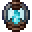

# Soul Lantern of Illusion

<small>[EnigmaticLegacy+](../../index.md) &rsaquo; [Items](../index.md) &rsaquo; [Spellstones](index.md)</small>

| | |
|---|---|
| **ID** | `enigmaticlegacyplus:illusion_lantern` |
| **Category** | Spellstones |
| **Rarity** | Rare |

## Description

Active ability:

- Absent.

Сooldown: ? seconds

Passive abilities:

- Generate soul fireball to automatically attack surrounding creatures

- The damage suffered will be shared among the surrounding creatures.

- Ordinary Undead will not target you actively.

- Significantly reduced defence-bypassing damage.

- Surrounding plant blocks will automatically disappear.

- When the brightness is too high, suffering curse damage.

- Minor increase in non magical damage received.

Hold Shift to see details.

## What it does

Used to make [Non-Euclidean Cube](the-cube.md). It is made at the Spellstone Table.

## Obtaining

### Recipes

**Spellstone Table** &rarr;  [Soul Lantern of Illusion](illusion-lantern.md)

Ingredients:  [Soul Soil](https://minecraft.wiki/w/Soul_Soil),  [Cyan Stained Glass](https://minecraft.wiki/w/Cyan_Stained_Glass),  [Netherite Scrap](https://minecraft.wiki/w/Netherite_Scrap),  [Blaze Powder](https://minecraft.wiki/w/Blaze_Powder),  [Netherite Scrap](https://minecraft.wiki/w/Netherite_Scrap),  [Cyan Stained Glass](https://minecraft.wiki/w/Cyan_Stained_Glass),  [Soul Soil](https://minecraft.wiki/w/Soul_Soil)

Details: debris count 10

## Used in

[Non-Euclidean Cube](the-cube.md)

## Config

Set in [`serverconfig/enigmaticlegacyplus-server.toml`](../../configs/serverconfig-enigmaticlegacyplus-server.md).

| Option | Default | Description |
|---|---|---|
| `illusionLantern.vulnerabilityModifier` | 1.25 (1 to 20) |  |
| `illusionLantern.resistanceModifier` | 50 (0 to 80) |  |
| `illusionLantern.cooldown` | 60 (20 to 200) |  |

## Tags

`enigmaticlegacyplus:materials_of_the_cube`
