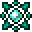
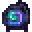
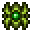
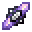

# Spellstones

<small>[EnigmaticLegacy+](../../index.md) &rsaquo; [Items](../index.md)</small>

| | Name | Description |
|---|---|---|
|  | [Angel's Blessing](angel-blessing.md) | Active ability: |
|  | [Blazing Core](blazing-core.md) | Active ability: |
|  | [Etherium Core](etherium-core.md) | Active ability: |
|  | [Eye of the Nebula](eye-of-nebula.md) | Active ability: |
|  | [Forgotten Ice Crystal](forgotten-ice.md) | Active ability: |
|  | [Heart of Creation](creation-heart.md) | Active ability: |
|  | [Heart of the Golem](golem-heart.md) | Active ability: |
|  | [Lost Engine](lost-engine.md) | Active ability: |
|  | [Non-Euclidean Cube](the-cube.md) | Active ability: |
|  | [Pearl of the Void](void-pearl.md) | Active ability: |
|  | [Resonator of Spell](spellstone-sword.md) | Right-click to resonate with the Spellstone in the off hand. |
|  | [Revival Leaves](revival-leaf.md) | Active ability: |
|  | [Soul Lantern of Illusion](illusion-lantern.md) | Active ability: |
|  | [Spellcore](spellcore.md) | The core that spellstones are built on. |
|  | [Spelltuner](spelltuner.md) | Right click the Spellstone in the inventory to |
|  | [Will of the Ocean](ocean-stone.md) | Active ability: |
