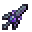

# Resonator of Spell

<small>[EnigmaticLegacy+](../../index.md) &rsaquo; [Items](../index.md) &rsaquo; [Spellstones](index.md)</small>

| | |
|---|---|
| **ID** | `enigmaticlegacyplus:spellstone_sword` |
| **Category** | Spellstones |
| **Durability** | 999 |
| **Rarity** | Rare |
| **Fire resistant** | Yes |

## Description

Right-click to resonate with the Spellstone in the off hand.

Right-click on this while holding the Spellcore to increase resonance level.

Resonance Effect:

Current Resonance: Absent.

Current Resonance: ?.

Resonance Level：?

Resonator of Golem

Resonator of Blaze

Resonator of Ocean

Resonator of Forgotten

Resonator of Revival

Resonator of Angel

Resonator of Engine

Resonator of Illusion

Resonator of Nebula

Resonator of Void

## What it does

It is crafted.

## Obtaining

### Recipes

**Crafting (shaped)** &rarr;  [Resonator of Spell](spellstone-sword.md)

| | | |
|---|---|---|
|  [Amethyst Shard](https://minecraft.wiki/w/Amethyst_Shard) |  [Spellstone Debris](../miscellaneous/spellstone-debris.md) |  [Amethyst Shard](https://minecraft.wiki/w/Amethyst_Shard) |
|  [Spellstone Debris](../miscellaneous/spellstone-debris.md) |  [Spellcore](spellcore.md) |  [Spellstone Debris](../miscellaneous/spellstone-debris.md) |
|   |  [Stick](https://minecraft.wiki/w/Stick) |   |

## Tags

`minecraft:enchantable/durability`, `minecraft:enchantable/vanishing`, `minecraft:swords`
