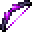

# Dragon Breath Bow

<small>[EnigmaticLegacy+](../../index.md) &rsaquo; [Items](../index.md) &rsaquo; [Tools](index.md)</small>

| | |
|---|---|
| **ID** | `enigmaticlegacyplus:dragon_breath_bow` |
| **Category** | Tools |
| **Durability** | 1,574 |
| **Rarity** | Rare |

## Description

Current Effects:

Right-click with a Splash Potion on

this bow to absorb the potion effect.

## Obtaining

### Recipes

**Crafting (shaped)** &rarr;  [Dragon Breath Bow](dragon-breath-bow.md)

| | | |
|---|---|---|
|  [Dragon Breath](https://minecraft.wiki/w/Dragon_Breath) |  [Ender Rod](../generic/ender-rod.md) |  [Dragon Breath](https://minecraft.wiki/w/Dragon_Breath) |
|  [Etherium Ingot](../materials/etherium-ingot.md) |  [Dragon Head](https://minecraft.wiki/w/Dragon_Head) |  [Dragon Breath](https://minecraft.wiki/w/Dragon_Breath) |
|  [Dragon Breath](https://minecraft.wiki/w/Dragon_Breath) |  [Ender Rod](../generic/ender-rod.md) |  [Dragon Breath](https://minecraft.wiki/w/Dragon_Breath) |

## Tags

`c:tools/bow`, `minecraft:enchantable/bow`, `minecraft:enchantable/durability`
