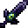
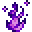

# The Ender Slayer

<small>[EnigmaticLegacy+](../../index.md) &rsaquo; [Items](../index.md) &rsaquo; [Tools](index.md)</small>

| | |
|---|---|
| **ID** | `enigmaticlegacyplus:ender_slayer` |
| **Category** | Tools |
| **Rarity** | Rare |
| **Fire resistant** | Yes |

## Description

+150% Damage against dwellers of The End.

In The End, fully charged attacks deal

colossal damage to Endermen, and all drops

from them are transformed into experience.

Temporarily disables teleportation abilities of

Shulkers and Endermen.

Temporarily disables active ability of Eye of

Nebula, Non-Euclidean Cube and ability to use

Ender Pearls, Potions of Recall and Twisted

Mirror for attacked players.

To exterminate them all...

Is such the only way?

## Obtaining

### Recipes

**Crafting (cursed)** &rarr;  [The Ender Slayer](ender-slayer.md)

| | | |
|---|---|---|
|  [Nefarious Essence](../materials/evil-essence.md) |  [Obsidian](https://minecraft.wiki/w/Obsidian) |  [Nefarious Essence](../materials/evil-essence.md) |
|  [Ender Eye](https://minecraft.wiki/w/Ender_Eye) |  [Obsidian](https://minecraft.wiki/w/Obsidian) |  [Ender Eye](https://minecraft.wiki/w/Ender_Eye) |
|  [Ghast Tear](https://minecraft.wiki/w/Ghast_Tear) |  [Stick](https://minecraft.wiki/w/Stick) |  [Ghast Tear](https://minecraft.wiki/w/Ghast_Tear) |

## Config

Set in [`serverconfig/enigmaticlegacyplus-server.toml`](../../configs/serverconfig-enigmaticlegacyplus-server.md).

| Option | Default | Description |
|---|---|---|
| `enderSlayer.specialDamageBoost` | 150 (0 to 1,000) |  |

## Tags

`minecraft:swords`
