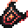

# Bulwark of Blazing Pride

<small>[EnigmaticLegacy+](../../index.md) &rsaquo; [Items](../index.md) &rsaquo; [Tools](index.md)</small>

| | |
|---|---|
| **ID** | `enigmaticlegacyplus:infernal_shield` |
| **Category** | Tools |
| **Rarity** | Rare |
| **Fire resistant** | Yes |

## Description

When equipped:

- Extinguishes you when on fire.

When blocking:

- Can block attacks immediately after being raised.

- Can block Piercing-enchanted arrows.

- Cannot be disabled by weapons normally effective against shields.

- Burns attackers when blocking melee damage.

- Successful blocks grant increasing Blazing Might effect.

- Enemy attacks from behind deal 50% more damage.

## What it does

It is made at the Crafting (cursed).

## Obtaining

### Recipes

**Crafting (cursed)** &rarr;  [Bulwark of Blazing Pride](infernal-shield.md)

| | | |
|---|---|---|
|  [Infernal Cinder](../generic/infernal-cinder.md) |  [Netherite Ingot](https://minecraft.wiki/w/Netherite_Ingot) |  [Infernal Cinder](../generic/infernal-cinder.md) |
|  [Blaze Rod](https://minecraft.wiki/w/Blaze_Rod) |  [Shield](https://minecraft.wiki/w/Shield) |  [Blaze Rod](https://minecraft.wiki/w/Blaze_Rod) |
|  [Obsidian](https://minecraft.wiki/w/Obsidian) |  [Twisted Heart](../materials/twisted-heart.md) |  [Obsidian](https://minecraft.wiki/w/Obsidian) |

## Tags

`c:tools/shield`, `minecraft:enchantable/durability`, `minecraft:enchantable/vanishing`
