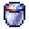

# Starlight Bucket

<small>[EnigmaticLegacy+](../../index.md) &rsaquo; [Items](../index.md) &rsaquo; [Tools](index.md)</small>

| | |
|---|---|
| **ID** | `enigmaticlegacyplus:starlight_bucket` |
| **Category** | Tools |

## Description

Right-click the item with bucket items to change the contained liquid.

None

Current Fluid: ?.

## What it does

It is crafted.

## Obtaining

### Recipes

**Crafting (shaped)** &rarr;  [Starlight Bucket](starlight-bucket.md)

| | | |
|---|---|---|
|   |   |   |
|  [Particle of Starlight](../materials/starlight-particle.md) |  [Astral Dust](../generic/astral-dust.md) |  [Particle of Starlight](../materials/starlight-particle.md) |
|   |  [Starlight Ingot](../materials/starlight-ingot.md) |   |

## Config

Set in [`serverconfig/enigmaticlegacyplus-server.toml`](../../configs/serverconfig-enigmaticlegacyplus-server.md).

| Option | Default | Description |
|---|---|---|
| `starlightBucket.checkExtraContent` | false |  |

## Tags

`c:buckets`
