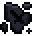

# Charred

<small>[More Relics](../index.md) &rsaquo; [Effects](index.md)</small>

| | |
|---|---|
| **ID** | `morerelics:charred` |
| **Type** | Harmful |
| **Color** | `#000000` |

> Increases damage taken from any source by 1 per level of this effect.
