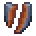
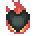

# Effects

<small>[More Relics](../index.md)</small>

Status effects added by More Relics.

| | Effect | Type | Description |
|---|---|---|---|
|  | [Accelerating](accelerating.md) | Beneficial | Makes the user increasingly stronger when used with Made in Heaven. |
|  | [Charred](charred.md) | Harmful | Increases damage taken from any source by 1 per level of this effect. |
|  | [Corrosion](corrosion.md) | Harmful | A corrosive effect that eats away at equipment, reducing armor. |
|  | [Cyberpsychosis](cyberpsychosis.md) | Beneficial | Slightly increases speed and damage while significantly improving Cyberware abilities but erodes sanity, making the familiar foreign. |
|  | [Dazed](dazed.md) | Harmful | Makes it so the entity can miss their attacks. |
|  | [Nullification](nullification.md) | Beneficial | Grants invincibility. |
|  | [Overload](overload.md) | Beneficial | Slightly increases speed. Can be consumed for better Thermal Discharges in Thermoseismic Heart. |
|  | [Static](static.md) | Harmful | Makes it so the player cannot see other players or mobs. |
|  | [Vulnerability](vulnerability.md) | Harmful | Increases incoming damage by %20 per amplifier. |
