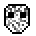

# Static

<small>[More Relics](../index.md) &rsaquo; [Effects](index.md)</small>

| | |
|---|---|
| **ID** | `morerelics:static` |
| **Type** | Harmful |
| **Color** | `#A9A9A9` |

> Makes it so the player cannot see other players or mobs.
