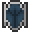

# Runic Plate

<small>[More Relics](../../index.md) &rsaquo; [Items](../index.md) &rsaquo; [Back](index.md)</small>

| | |
|---|---|
| **ID** | `morerelics:runic_plate` |
| **Category** | Back |
| **Curio slot** | Back, Charm |

## Relic abilities

Relic levelling: up to level **8**, first level costs **125** XP, +25 XP per level.

> A rune-carved plate forged by Stafir of the legendary twin smiths. It is said to be able to block not just physical blows, but fate itself.

Found in loot chests of kind: chests in mountain biomes.

### Head Start

*Passive. Ability max level 4.*

Upon entering combat, the damage of the first **1-2 (up to 3-4)** attacks you take is reduced by **24-34 (up to 40-50)**%.  
  
You are considered out of combat if you haven't dealt or taken damage for 15 seconds.

| Stat | Starting value | Per level | At max level |
|---|---|---|---|
| Damage Reduction | 24-34 | +4 per level | 40-50 |
| Hit Count | 1-2 | +0.5 per level | 3-4 |

### Peaceland

*Unlocks at relic level 4, passive. Ability max level 4.*

You restore **0.8-1.1 (up to 1.2-1.5)** health per second while out of combat. This healing can overheal you up to **4-6 (up to 6-8)** health.

| Stat | Starting value | Per level | At max level |
|---|---|---|---|
| Heal Amount | 0.8-1.1 | +0.1 per level | 1.2-1.5 |
| Overheal Amount | 4-6 | +0.5 per level | 6-8 |

### Blood Bond

*Unlocks at relic level 8, passive. Ability max level 10.*

If you also have Swiftedge equipped, Head Start's boosted attack count is increased by 50%.

## Tags

`curios:back`, `curios:charm`
