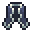

# Shieldweave Cape

<small>[More Relics](../../index.md) &rsaquo; [Items](../index.md) &rsaquo; [Back](index.md)</small>

| | |
|---|---|
| **ID** | `morerelics:shieldweave_cape` |
| **Category** | Back |
| **Curio slot** | Back |

## Relic abilities

Relic levelling: up to level **10**, first level costs **100** XP, +50 XP per level.

> A cape woven with steel-like threads that adjust to the wearer's armor, covering weak spots.

Found in loot chests of kind: chests in cave biomes, chests in taiga biomes, chests in mountain biomes, any Overworld chest.

### Impact Shield

*Passive. Ability max level 5.*

The cape hardens upon impact, blocking the hit with **3-6 (up to 7-10)**% + **0.15-0.3 (up to 0.35-0.5)**% * armor chance (max 33%).

| Stat | Starting value | Per level | At max level |
|---|---|---|---|
| Flat Chance | 3-6 | +0.8 per level | 7-10 |
| Per Armor | 0.15-0.3 | +0.04 per level | 0.35-0.5 |

### Dynamic Thread

*Unlocks at relic level 5, passive. Ability max level 5.*

The cape covers your weak spots, increasing your armor by **4-8 (up to 11.5-15.5)**%.

| Stat | Starting value | Per level | At max level |
|---|---|---|---|
| Perch | 4-8 | +1.5 per level | 11.5-15.5 |

## Tags

`curios:back`
