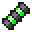

# VertebraX

<small>[More Relics](../../index.md) &rsaquo; [Items](../index.md) &rsaquo; [Back](index.md)</small>

| | |
|---|---|
| **ID** | `morerelics:vertebrax` |
| **Category** | Back |
| **Curio slot** | Back |

## Relic abilities

Relic levelling: up to level **8**, first level costs **120** XP, +30 XP per level.

> A high-tech spine implant designed to boost immunity by continuously injecting poison into the body... It was quickly banned and pulled from the market due to obvious reasons.

Found in loot chests of kind: any End chest.

### Inoculation

*Passive. Ability max level 10.*

Continuously applies poison while equipped.

### Fortification

*Unlocks at relic level 3, passive. Ability max level 5.*

Harmful potion effects have their duration reduced by **12-20 (up to 32-40)**%. These effects have a **15-25 (up to 40-50)**% chance to be filtered, decreasing their level or reducing duration by an additional 20% if the level is already at its minimum. Filtration also synthesizes the opposite beneficial effect for half the original duration if it exists.  
While cyberpsychosis is active: Synthesized effects are more powerful and the reduction is amplified by 50%.

| Stat | Starting value | Per level | At max level |
|---|---|---|---|
| Reduction | 12-20 | +4 per level | 32-40 |
| Increase | 15-25 | +5 per level | 40-50 |

### Acquired Immunity

*Unlocks at relic level 5, passive. Ability max level 10.*

Completely converts Poison into Regeneration for its full duration.

### Cyberpsychosis

*Unlocks at relic level 5, passive. Ability max level 3.*

Killing an enemy has a **3-5 (up to 6-8)**% chance to trigger Cyberpsychosis for **4-7 (up to 10-13)** seconds.  
The chance and duration stacks with other Cyberware with this ability.  
Cyberpsychosis: Significantly improves Cyberware abilities but erodes sanity, making the familiar foreign.

| Stat | Starting value | Per level | At max level |
|---|---|---|---|
| Chance | 3-5 | +1 per level | 6-8 |
| Duration | 4-7 | +2 per level | 10-13 |

## Tags

`curios:back`
