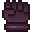
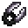

# Hands

<small>[More Relics](../../index.md) &rsaquo; [Items](../index.md)</small>

| | Name | Description |
|---|---|---|
|  | [Gravitum Glove](gravitum-glove.md) | A glove which is made from a unique cloth-like material which anchors itself to its current position, making it very... |
|  | [Mass Gauntlet](mass-gauntlet.md) | A gauntlet with a massive iron ball affixed to it, designed to force the user's body to move in sync with their... |
|  | [Sentient Rust](sentient-rust.md) | A cluster of Ferro Comedenti fungi, a rare species of fungus which rapidly corrodes metal on contact. Commonly known... |
|  | [Twin Fangs](twin-fangs.md) | A wrist attachment with dual curved blades pointing outward. It is designed to be used alongside a primary weapon,... |
