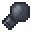

# Mass Gauntlet

<small>[More Relics](../../index.md) &rsaquo; [Items](../index.md) &rsaquo; [Hands](index.md)</small>

| | |
|---|---|
| **ID** | `morerelics:mass_gauntlet` |
| **Category** | Hands |
| **Curio slot** | Hands |

## Relic abilities

Relic levelling: up to level **5**, first level costs **80** XP, +20 XP per level.

> A gauntlet with a massive iron ball affixed to it, designed to force the user's body to move in sync with their strikes. This unique design amplifies the power of each attack as the user's weight is channeled into every blow.

Found in loot chests of kind: any chest.

### Heavy Hitter

*Passive. Ability max level 5.*

Your attacks deal **6-10 (up to 14-18)**% of your maximum health as extra damage with a small cooldown.

| Stat | Starting value | Per level | At max level |
|---|---|---|---|
| Perch | 6-10 | +1.6 per level | 14-18 |

## Tags

`curios:hands`
