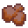

# Sentient Rust

<small>[More Relics](../../index.md) &rsaquo; [Items](../index.md) &rsaquo; [Hands](index.md)</small>

| | |
|---|---|
| **ID** | `morerelics:sentient_rust` |
| **Category** | Hands |
| **Curio slot** | Hands |

## Relic abilities

Relic levelling: up to level **5**, first level costs **150** XP, +30 XP per level.

> A cluster of Ferro Comedenti fungi, a rare species of fungus which rapidly corrodes metal on contact. Commonly known as 'Sentient Rust' for its reddish hue.

Found in loot chests of kind: mineshaft chests, chests in mountain biomes, chests in swamp biomes.

### Corrosive

*Passive. Ability max level 5.*

Applies an armor-corroding effect for **20-30 (up to 45-55)** seconds. Consecutive hits refresh the duration and stack the effect (up to 10 times). Each stack reduces armor by %5.

| Stat | Starting value | Per level | At max level |
|---|---|---|---|
| Seconds | 20-30 | +5 per level | 45-55 |

## Tags

`curios:hands`
