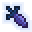
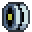
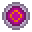
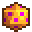
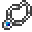

# Items

<small>[More Relics](../index.md)</small>

More Relics adds **29** items.

| Group | Count |
|---|---|
| [Back](back/index.md) | 7 |
| [Belt](belt/index.md) | 5 |
| [Body](body/index.md) | 1 |
| [Charm](charm/index.md) | 2 |
| [Feet](feet/index.md) | 1 |
| [Hands](hands/index.md) | 4 |
| [Head](head/index.md) | 4 |
| [Necklace](necklace/index.md) | 3 |
| [Relics](relics/index.md) | 1 |
| [Ring](ring/index.md) | 1 |

## Back

| | Name | ID |
|---|---|---|
|  | [Converging Orb](back/converging-orb.md) | `morerelics:converging_orb` |
|  | [Made in Heaven](back/made-in-heaven.md) | `morerelics:made_in_heaven` |
|  | [Runic Plate](back/runic-plate.md) | `morerelics:runic_plate` |
|  | [Shieldweave Cape](back/shieldweave-cape.md) | `morerelics:shieldweave_cape` |
|  | [Swiftedge](back/swiftedge.md) | `morerelics:swiftedge` |
|  | [VertebraX](back/vertebrax.md) | `morerelics:vertebrax` |
|  | [Wonder of U](back/wonder-of-u.md) | `morerelics:wonder_of_u` |

## Belt

| | Name | ID |
|---|---|---|
|  | [Axolotl Cream](belt/axolotl-cream.md) | `morerelics:axolotl_cream` |
|  | [Biojoint](belt/biojoint.md) | `morerelics:biojoint` |
|  | [Depleted Spool](belt/depleted-spool.md) | `morerelics:depleted_spool` |
|  | [Eject Button](belt/eject-button.md) | `morerelics:eject_button` |
|  | [Weavers Spool](belt/weavers-spool.md) | `morerelics:weavers_spool` |

## Body

| | Name | ID |
|---|---|---|
|  | [Thermoseismic Heart](body/thermoseismic-heart.md) | `morerelics:thermoseismic_heart` |

## Charm

| | Name | ID |
|---|---|---|
|  | [Guts Orb](charm/guts-orb.md) | `morerelics:guts_orb` |
|  | [Whims of Fate](charm/whims-of-fate.md) | `morerelics:whims_of_fate` |

## Feet

| | Name | ID |
|---|---|---|
|  | [Gravitum Strider](feet/gravitum-strider.md) | `morerelics:gravitum_strider` |

## Hands

| | Name | ID |
|---|---|---|
|  | [Gravitum Glove](hands/gravitum-glove.md) | `morerelics:gravitum_glove` |
|  | [Mass Gauntlet](hands/mass-gauntlet.md) | `morerelics:mass_gauntlet` |
|  | [Sentient Rust](hands/sentient-rust.md) | `morerelics:sentient_rust` |
|  | [Twin Fangs](hands/twin-fangs.md) | `morerelics:twin_fangs` |

## Head

| | Name | ID |
|---|---|---|
|  | [Bionic Eye](head/bionic-eye.md) | `morerelics:bionic_eye` |
|  | [Crown of the Legend](head/crown-of-the-legend.md) | `morerelics:crown_of_the_legend` |
|  | [King Crimson](head/king-crimson.md) | `morerelics:king_crimson` |
|  | [Tyrant Mask](head/tyrant-mask.md) | `morerelics:tyrant_mask` |

## Necklace

| | Name | ID |
|---|---|---|
|  | [Opal Necklace](necklace/opal-necklace.md) | `morerelics:opal_necklace` |
|  | [Slumbering Amulet](necklace/slumbering-amulet.md) | `morerelics:slumbering_amulet` |
|  | [Whispering Amulet](necklace/whispering-amulet.md) | `morerelics:whispering_amulet` |

## Relics

| | Name | ID |
|---|---|---|
|  | [Epoch Apple](relics/epoch-apple.md) | `morerelics:epoch_apple` |

## Ring

| | Name | ID |
|---|---|---|
|  | [Moodworm](ring/moodworm.md) | `morerelics:moodworm` |
