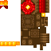

# Blocks

<small>[Relics](../index.md)</small>

Relics adds **2** blocks.

| | Name | ID |
|---|---|---|
|  | [Phantom Bridge Block](phantom-block.md) | `relics:phantom_block` |
|  | [Researching Table [Removed from the mod]](researching-table.md) | `relics:researching_table` |
