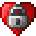
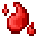
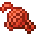
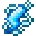
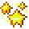

# Effects

<small>[Relics](../index.md)</small>

Status effects added by Relics.

| | Effect | Type | Description |
|---|---|---|---|
|  | [Anti-Heal](anti-heal.md) | Harmful | Stops all healing while it lasts. |
|  | [Bleeding](bleeding.md) | Harmful | Every second it deals magic damage equal to 5% of your current health (at most 10). |
|  | [Confusion](confusion.md) | Harmful | Reverses your movement controls: forward walks you backward and left moves you right. |
|  | [Immortality](immortality.md) | Beneficial | You can't be hurt at all while it lasts. |
|  | [Paralysis](paralysis.md) | Harmful | You can't move, jump or sneak while it lasts. |
|  | [Stun](stun.md) | Harmful | A stronger paralysis: you can't move, look around, attack or use items, and all your keys except Escape are ignored. |
|  | [Vanishing](vanishing.md) | Beneficial | Makes you completely invisible, including your armor and held items, and mobs can't see you. |
