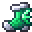
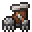
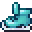
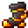
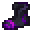
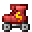
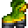

# Feet

<small>[Relics](../../index.md) &rsaquo; [Items](../index.md)</small>

| | Name | Description |
|---|---|---|
|  | [Amphibian Boot](amphibian-boot.md) | +1 experience point for each second of acceleration from the «Fins» ability. +1 experience point for every second of... |
|  | [Aqua Walker](aqua-walker.md) | +1 experience point for every 5 units of getting wet from the ability «Moisture Resistance». |
|  | [Ice Breaker](ice-breaker.md) | +1 experience point for every 3 blocks in the fall before triggering the ability «Earthquake». |
|  | [Ice Skates](ice-skates.md) | +1 experience point for each second of acceleration from the ability «Skating». |
|  | [Magma Walker](magma-walker.md) | +1 experience point for every 5 units of heating from the ability «Fiery Tread». |
|  | [Phantom Boot](phantom-boot.md) | Condenses matter beneath the relic owner's feet, creating a path through any terrain, even where no solid ground exists. |
|  | [Roller Skates](roller-skates.md) | +1 experience point for each second of acceleration from the ability «Acceleration». |
|  | [Springy Boot](springy-boot.md) | Grants the relic owner special elasticity, allowing them to bounce off any solid surface. |
