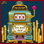

# Mammon: Sovereign Casino

<small>[TensuraMoreSkills](../../index.md) &rsaquo; [Abilities](../index.md) &rsaquo; [Ultimate Skills](index.md)</small>

| | |
|---|---|
| **Type** | Ultimate Skill |
| **ID** | `tensuramoreskills:mammon_casino` |
| **Modes** | 1 |
| **Acquisition cost (MP)** | 850,000 |
| **Activation** | Press |

> Earn Greed Chips on kills and gamble them for forbidden loot, power, and an extremely tiny chance at a new Ultimate Skill.

## Modes

| # | Mode |
|---|---|
| 1 | Open Casino |

## How it works

- Activated by pressing the skill key

## Stats (config defaults)

Set in [`config/tensuramoreskills-grand.toml`](../../configs/config-tensuramoreskills-grand.md).

| Option | Default | Description |
|---|---|---|
| `obtainment.acquirementMagiculeCost` | 850,000 (0 to no limit) | Magicule cost required to naturally acquire Mammon Casino. |
| `obtainment.acquirementMastery` | 0 (-1 to no limit) | Starting mastery value when acquired. |
| `obtainment.requiredSkillId` | "tensura:greed" | Required skill registry ID for obtainment. Empty string disables the required skill check. |
| `obtainment.requiredSkillMustBeMastered` | true | If true, the required skill must be mastered before Mammon Casino can be acquired. |
| `chips.duplicateKillProtectionTicks` | 80 (0 to no limit) | Prevents the same killed entity from awarding chips again inside this time window. |
| `chips.chipsPerTrackedKill` | 1 (0 to no limit) | Chips gained for each tracked kill. |
