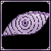

# Pain, Lord of Six Paths

<small>[TensuraMoreSkills](../../index.md) &rsaquo; [Abilities](../index.md) &rsaquo; [Ultimate Skills](index.md)</small>

| | |
|---|---|
| **Type** | Ultimate Skill |
| **ID** | `tensuramoreskills:pain_lord_of_six_paths` |
| **Modes** | 5 |
| **Acquisition cost (MP)** | 1,000,000 |
| **Max mastery** | 6,000 |
| **Cooldowns (s)** | 200 or 30, 100, 2, 90, 50, 30 |
| **Activation** | Toggle, Press, Hold |

> This world shall know pain.

## Modes

| # | Mode |
|---|---|
| 1 | Almighty Push |
| 2 | Universal Pull |
| 3 | Six Paths |
| 4 | Heavenly Rupture |
| 5 | Planetary Devastation |

## Costs

| When | Magicule (MP) | Aura (AP) |
|---|---|---|
| Almighty Push | 120,000 |  |
| Universal Pull | 70,000 |  |
| Six Paths | *set by config (path (path cost))* |  |
| Heavenly Rupture | 150,000 |  |
| Planetary Devastation | 600,000 |  |
| other modes | 0 |  |

## How it works

- Can be toggled on and off
- Activated by pressing the skill key
- Charged or channelled by holding the skill key
- Triggers when the held key is released
- Has a continuous (per-tick) effect
- Triggers when you are attacked

## Obtaining

- Acquisition checks: [Gravity Manipulation](../../../tensura-reincarnated/abilities/extra-skills/gravity-manipulation.md)

## Related

- **Related skills:** [Gravity Manipulation](../../../tensura-reincarnated/abilities/extra-skills/gravity-manipulation.md), [Burden](../../../tensura-reincarnated/abilities/aspectual-magic/burden.md), [Magic Barrier](../../../tensura-reincarnated/abilities/aspectual-magic/magic-barrier.md), [Curse](../../../tensura-reincarnated/abilities/spiritual-magic/curse.md)
- **Effects:** [Movement Interference](../../../tensura-reincarnated/effects/movement-interference.md), [Soul Drain](../../../tensura-reincarnated/effects/soul-drain.md), [Insanity](../../../tensura-reincarnated/effects/insanity.md), [Magic Aura](../../../tensura-reincarnated/effects/magic-aura.md), [Magic Interference](../../../tensura-reincarnated/effects/magic-interference.md), [Fear](../../../tensura-reincarnated/effects/fear.md), [Magicule Poison](../../../tensura-reincarnated/effects/magicule-poison.md), [Silence](../../../tensura-reincarnated/effects/silence.md)
- **Summons / entities:** Tensura, [Direwolf](../../../tensura-reincarnated/mobs/direwolf.md), [Barghest](../../../tensura-reincarnated/mobs/barghest.md), [Blade Tiger](../../../tensura-reincarnated/mobs/blade-tiger.md), [Pegasus](../../../tensura-reincarnated/mobs/pegasus.md), [Giant Bear](../../../tensura-reincarnated/mobs/giant-bear.md), [Feathered Serpent](../../../tensura-reincarnated/mobs/feathered-serpent.md)

## Stats (config defaults)

Set in [`config/tensuramoreskills-grand.toml`](../../configs/config-tensuramoreskills-grand.md).

| Option | Default | Description |
|---|---|---|
| `acquirementMagiculeCost` | 1,000,000 (0 to no limit) |  |
| `acquirementMastery` | 0 (0 to no limit) |  |
| `maxMastery` | 6,000 (0 to no limit) |  |
| `requiredSkillId` | "tensura:oppressor" |  |
| `requiredSkillMustBeMastered` | true |  |
| `requiredEp` | 1,000,000 (0 to no limit) |  |
| `almightyPushCost` | 120,000 (0 to no limit) |  |
| `universalPullCost` | 70,000 (0 to no limit) |  |
| `heavenlyRuptureCost` | 150,000 (0 to no limit) |  |
| `planetaryDevastationCost` | 600,000 (0 to no limit) |  |
| `passiveRefreshTicks` | 40 (0 to no limit) |  |
| `pathPretaRadius` | 8 (0 to no limit) |  |
| `pathPretaProjectileSpeed` | 3.5 (0 to no limit) |  |
| `pathPretaMinAbsorbGain` | 5,000 (0 to no limit) |  |
| `pathPretaDamageToMagiculeRatio` | 60 (0 to no limit) |  |
| `almightyPushMaxChargeTicks` | 1,200 (0 to no limit) |  |
| `almightyPushChargeParticleIntervalTicks` | 5 (0 to no limit) |  |
| `almightyPushMinChargeTicks` | 20 (0 to no limit) |  |
| `almightyPushMinDamage` | 120 (0 to no limit) |  |
| `almightyPushMaxDamageMastered` | 14,000 (0 to no limit) |  |
| `almightyPushMaxDamage` | 9,000 (0 to no limit) |  |
| `almightyPushMinFalloff` | 0.25 (0 to no limit) |  |
| `almightyPushVerticalLift` | 0.75 (0 to no limit) |  |
| `almightyPushBurdenTicks` | 160 (0 to no limit) |  |
| `almightyPushBurdenAmplifier` | 2 (0 to no limit) |  |
| `almightyPushStaggerTicks` | 80 (0 to no limit) |  |
| `almightyPushStaggerAmplifier` | 2 (0 to no limit) |  |
| `almightyPushProjectileSpeed` | 3.2 (0 to no limit) |  |
| `almightyPushMaxCooldownTicks` | 200 (0 to no limit) |  |
| `almightyPushCooldownTicks` | 30 (0 to no limit) |  |
| `universalPullRangeMastered` | 72 (0 to no limit) |  |
| `universalPullRange` | 48 (0 to no limit) |  |
| `universalPullForceMastered` | 5.2 (0 to no limit) |  |
| `universalPullForce` | 3.4 (0 to no limit) |  |
| `pathDevaRadius` | 10 (0 to no limit) |  |
| `pathDevaForce` | 3 (0 to no limit) |  |
| `pathDevaDamage` | 1,800 (0 to no limit) |  |
| `pathDevaCooldownTicks` | 2 (0 to no limit) |  |
| `pathAsuraShots` | 12 (0 to no limit) |  |
| `pathAsuraShotSpacing` | 3 (0 to no limit) |  |
| `pathAsuraShotRadius` | 2.4 (0 to no limit) |  |
| `pathAsuraDamage` | 900 (0 to no limit) |  |
| `pathAsuraForce` | 1.6 (0 to no limit) |  |
| `pathAsuraCooldownTicks` | 2 (0 to no limit) |  |
| `pathHumanRange` | 6 (0 to no limit) |  |
| `failedTargetCooldownTicks` | 2 (0 to no limit) |  |
| `pathHumanMaxDamage` | 9,000 (0 to no limit) |  |
| `pathHumanHealthRatio` | 0.35 (0 to no limit) |  |
| `pathHumanMinDamage` | 500 (0 to no limit) |  |
| `pathHumanEnergyDrain` | 250,000 (0 to no limit) |  |
| `pathHumanSoulDrainTicks` | 60 (0 to no limit) |  |
| `pathHumanSoulDrainAmplifier` | 2 (0 to no limit) |  |
| `pathHumanCooldownTicks` | 100 (0 to no limit) |  |
| `pathAnimalSummonsMastered` | 6 (0 to no limit) |  |
| `pathAnimalSummons` | 3 (0 to no limit) |  |
| `pathAnimalTargetRange` | 48 (0 to no limit) |  |
| `pathAnimalCooldownTicks` | 100 (0 to no limit) |  |
| `pathAnimalSpawnRadius` | 3.5 (0 to no limit) |  |
| `pathAnimalDurationTicks` | 1,200 (0 to no limit) |  |
| `pathAnimalAuraAmplifier` | 1 (0 to no limit) |  |
| `pathPretaDurationTicks` | 90 (0 to no limit) |  |
| `pathPretaBarrierAmplifier` | 3 (0 to no limit) |  |
| `pathPretaMagicInterferenceAmplifier` | 3 (0 to no limit) |  |
| `pathPretaCooldownTicks` | 90 (0 to no limit) |  |
| `pathPretaProjectileAbsorbIntervalTicks` | 5 (0 to no limit) |  |
| `pathNarakaMinHeal` | 30 (0 to no limit) |  |
| `pathNarakaHealRatio` | 0.45 (0 to no limit) |  |
| `pathNarakaMagiculeHeal` | 250,000 (0 to no limit) |  |
| `pathNarakaSpiritualHeal` | 50,000 (0 to no limit) |  |
| `pathNarakaCooldownTicks` | 50 (0 to no limit) |  |
| `heavenlyRuptureRange` | 54 (0 to no limit) |  |
| `heavenlyRuptureDamageMastered` | 4,500 (0 to no limit) |  |
| `heavenlyRuptureDamage` | 2,500 (0 to no limit) |  |
| `heavenlyRuptureLaunchMastered` | 4.6 (0 to no limit) |  |
| `heavenlyRuptureLaunch` | 3.2 (0 to no limit) |  |
| `heavenlyRuptureBurdenTicks` | 120 (0 to no limit) |  |
| `heavenlyRuptureBurdenAmplifier` | 2 (0 to no limit) |  |
| `heavenlyRuptureDropDelayTicks` | 35 (0 to no limit) |  |
| `heavenlyRuptureCooldownTicks` | 30 (0 to no limit) |  |
| `planetaryDevastationCooldownTicks` | 24 (0 to no limit) |  |
| `almightyPushMinChargeRatio` | 0.04 (0 to no limit) |  |
| `pathDevaCost` | 65,000 (0 to no limit) |  |
| `pathAsuraCost` | 90,000 (0 to no limit) |  |
| `pathHumanCost` | 160,000 (0 to no limit) |  |
| `pathAnimalCost` | 140,000 (0 to no limit) |  |
| `pathPretaCost` | 90,000 (0 to no limit) |  |
| `pathNarakaCost` | 180,000 (0 to no limit) |  |
| `pathPretaProjectileMagiculeGain` | 3,000 (0 to no limit) |  |

Set in [`config/tensura/ability/ability_config.toml`](../../../tensura-reincarnated/configs/config-tensura-ability-ability-config.md).

| Option | Default | Description |
|---|---|---|
| `Mastery.masteryHoldTick` | 60 | How long in tick the user need to hold down an ability to gain a mastery point for holding abilities. |
| `Mastery.masteryPoint` | 1 | The base value of how many mastery points the player gains when using an ability - Only applies for new players when changed cus this is an attribute. |
| `Mastery.masteryHitMultiplier` | 2 | The multiplier of mastery point the player gains when the ability hit a target. |
| `Mastery.masteryKillMultiplier` | 2 | The multiplier of mastery point the player gains when the ability kills a target. |
| `Mastery.masteryHoldTick` | 60 | How long in tick the user need to hold down an ability to gain a mastery point for holding abilities. |
| `Mastery.masteryActivateTime` | 10 | How many time the user need to activate some passive abilities (tick/on attack) to gain a mastery point for holding abilities. |

## In-game messages

Show 13 messages

- Path selected: %s
- Deva Path
- Asura Path
- Human Path
- Animal Path
- Preta Path
- Naraka Path
- Chibaku Tensei!
- You will know Pain!
- A Planetary Devastation is already active.
- Almighty Push Charge: %s%%
- Six Paths perception awakened.
- Six Paths perception fades.

