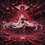

# Ronova

<small>[TensuraMoreSkills](../../index.md) &rsaquo; [Abilities](../index.md) &rsaquo; [Ultimate Skills](index.md)</small>

| | |
|---|---|
| **Type** | Ultimate Skill |
| **ID** | `tensuramoreskills:ronova` |
| **Modes** | 5 |
| **Activation** | Toggle, Press, Hold |

> Death abides no reason—  
> For it cannot be defied.  
> Even by those who see it coming.

## Modes

| # | Mode |
|---|---|
| 1 | Spiritual Force |
| 2 | Salvation Lord |
| 3 | Ally Sacrifice |
| 4 | Death Field |
| 5 | Finality |

## Costs

| When | Magicule (MP) | Aura (AP) |
|---|---|---|
| Spiritual Force | *set by config (spiritual force cost)* |  |
| Salvation Lord | *set by config (salvation lord cost)* |  |
| Ally Sacrifice | *set by config (ally sacrifice cost)* |  |
| Death Field | *set by config (death field cost)* |  |
| Finality | *set by config (finality cost)* |  |
| other modes | 0 |  |

## How it works

- Can be toggled on and off
- Activated by pressing the skill key
- Charged or channelled by holding the skill key
- Triggers when the held key is released
- Has a continuous (per-tick) effect
- Does something when first learned
