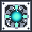

# Schwi, Lord of True Computation

<small>[TensuraMoreSkills](../../index.md) &rsaquo; [Abilities](../index.md) &rsaquo; [Ultimate Skills](index.md)</small>

| | |
|---|---|
| **Type** | Ultimate Skill |
| **ID** | `tensuramoreskills:schwi_ex_machina` |
| **Modes** | 5 |
| **Acquisition cost (MP)** | 350,000 |
| **Max mastery** | 2,500 |
| **Cooldowns (s)** | 25, 2, 300, max(0, cd - extra dec) |
| **Activation** | Toggle, Press, Hold |

> Builds Calculation Stacks in combat to optimize damage and cooldown cycles.

## Modes

| # | Mode |
|---|---|
| 1 | Tactical Weapon Deployment |
| 2 | Target Elimination Protocol |
| 3 | Continuous Fire Sequence |
| 4 | Structural Analysis |
| 5 | Final Calculation |

## Costs

| When | Magicule (MP) | Aura (AP) |
|---|---|---|
| Tactical Weapon Deployment | 100 |  |
| Target Elimination Protocol | 100 |  |
| Continuous Fire Sequence | 100 |  |
| Structural Analysis | 100 |  |
| Final Calculation | 100 |  |
| other modes | 0 |  |

## How it works

- Can be toggled on and off
- Activated by pressing the skill key
- Charged or channelled by holding the skill key
- Has a continuous (per-tick) effect
- Triggers when you damage a target
- Triggers when you take damage
- Triggers when an effect is applied to you
- Triggers when a projectile hits you

## Related

- **Related skills:** [Abnormal Condition Nullification](../../../tensura-reincarnated/abilities/resistance-skills/abnormal-condition-nullification.md), [Curse](../../../tensura-reincarnated/abilities/spiritual-magic/curse.md), [Fire Bolt](../../../tensura-reincarnated/abilities/spiritual-magic/fire-bolt.md)
- **Effects:** [Chill](../../../tensura-reincarnated/effects/chill.md), [Black Burn](../../../tensura-reincarnated/effects/black-burn.md), [Magic Interference](../../../tensura-reincarnated/effects/magic-interference.md), [Spatial Blockade](../../../tensura-reincarnated/effects/spatial-blockade.md), [True Blindness](../../../tensura-reincarnated/effects/true-blindness.md), [Anti-Skill](../../../tensura-reincarnated/effects/anti-skill.md), [Magicule Poison](../../../tensura-reincarnated/effects/magicule-poison.md), [Disintegrating](../../../tensura-reincarnated/effects/disintegrating.md), [Soul Drain](../../../tensura-reincarnated/effects/soul-drain.md), [Fear](../../../tensura-reincarnated/effects/fear.md), [Infinite Imprisonment](../../../tensura-reincarnated/effects/infinite-imprisonment.md), [Infection](../../../tensura-reincarnated/effects/infection.md), [Energy Blockade](../../../tensura-reincarnated/effects/energy-blockade.md), [Silence](../../../tensura-reincarnated/effects/silence.md), [Rest](../../../tensura-reincarnated/effects/rest.md), [Drowsiness](../../../tensura-reincarnated/effects/drowsiness.md), [Mind Control](../../../tensura-reincarnated/effects/mind-control.md), [Movement Interference](../../../tensura-reincarnated/effects/movement-interference.md)

## Stats (config defaults)

Set in [`config/tensuramoreskills-grand.toml`](../../configs/config-tensuramoreskills-grand.md).

| Option | Default | Description |
|---|---|---|
| `obtainment.acquirementMagiculeCost` | 350,000 (0 to no limit) | Magicule cost required to naturally acquire the skill. |
| `obtainment.acquirementMastery` | -1 (-1 to no limit) | Starting mastery value when acquired. |
| `obtainment.requiredSkillId` | "tensura:mathematician" | Required skill registry ID for obtainment. Empty string disables the required skill check. |
| `obtainment.requiredSkillMustBeMastered` | true | If true, the required skill must be mastered before Schwi Ex Machina can be acquired. |
| `obtainment.maxMastery` | 2,500 (1 to no limit) | Maximum mastery value for Schwi Ex Machina. |
| `costs.autoShootingCost` | 100 (0 to no limit) | Magicule cost for Auto Shooting. |
| `costs.lockCost` | 100 (0 to no limit) | Magicule cost for Lock. |
| `costs.continuousFireCost` | 100 (0 to no limit) | Magicule cost for Continuous Fire checks. |
| `costs.structuralAnalysisCost` | 100 (0 to no limit) | Magicule cost for Structural Analysis. |
| `costs.finalCost` | 100 (0 to no limit) | Magicule cost for Final Mode. |
| `timing.buffRefreshTicks` | 20 (1 to no limit) | How often buffs refresh. Higher is better for performance. |
| `timing.zeroResistanceDurationTicks` | 60 (1 to no limit) | Resistance effect duration while toggled. |
| `lock.targetRange` | 70 (1 to 512) | Targeting range for Lock, Auto Shooting, Continuous Fire, and Structural Analysis. |
| `auto_shooting.autoShotIntervalTicks` | 40 (1 to no limit) | Delay between Auto Shooting volleys. |
| `calculation_stacks.maxStacksMastered` | 40 (0 to 10,000) | Maximum calculation stacks when mastered. |
| `calculation_stacks.maxStacksBase` | 30 (0 to 10,000) | Maximum calculation stacks before mastery. |
| `final_mode.overheatDurationTicks` | 300 (0 to no limit) | Overheat duration after Final Mode ends. |
| `continuous_fire.fireDrainCheckTicks` | 20 (1 to no limit) | How often Continuous Fire checks energy while held. |
| `continuous_fire.fireRampPerSecond` | 0.05 (0 to 100) | Damage ramp gained per second while holding Continuous Fire. |
| `continuous_fire.fireMaxBonus` | 0.4 (0 to 100) | Maximum ramp bonus outside Final Mode. 0.40 = 40 percent. |
| `projectiles.fireProjectileSpeed` | 2 (0 to 128) | Projectile speed for aimed Continuous Fire. |
| `projectiles.fireBaseDamage` | 1,000 (0 to 340282349999999991754788743781432688640) | Base damage of Continuous Fire projectiles before ramp. |
| `projectiles.blindFireProjectileSpeed` | 2.1 (0 to 128) | Projectile speed for Continuous Fire when no target is locked or aimed at. |
| `prediction.predictCritChance` | 0.9 (0 to 1) | Chance to force critical multiplier while above the health threshold. 0.90 = 90 percent. |
| `lock.lockDamageBonus` | 0.2 (0 to 100) | Bonus damage against locked targets. 0.20 = 20 percent. |
| `prediction.analysisDamageTakenBonus` | 0.6 (0 to 100) | Bonus damage against structurally analyzed targets. 0.60 = 60 percent. |
| `calculation_stacks.damagePerStack` | 0.02 (0 to 100) | Damage multiplier gained per stack. 0.02 = 2 percent per stack. |
| `prediction.predictDodgeChance` | 0.3 (0 to 1) | Chance to nullify direct melee/projectile damage. 0.30 = 30 percent. |
| `auto_shooting.autoDurationTicks` | 240 (1 to no limit) | Auto Shooting duration before mastery. |
| `auto_shooting.autoMasteredBonusDurationTicks` | 120 (0 to no limit) | Extra Auto Shooting duration when mastered. |
| `cooldowns.autoCooldownTicks` | 25 (0 to no limit) | Cooldown after Auto Shooting. |
| `lock.lockDurationTicks` | 800 (1 to no limit) | How long Lock stays on the target. |
| `lock.lockGlowDurationTicks` | 200 (1 to no limit) | Glowing duration applied to locked targets. |
| `lock.lockMovementInterferenceDurationTicks` | 120 (1 to no limit) | Movement Interference duration applied to locked targets. |
| `lock.lockMovementInterferenceAmplifier` | 0 (0 to 255) | Movement Interference amplifier applied to locked targets. 0 means level 1. |
| `cooldowns.lockCooldownTicks` | 2 (0 to no limit) | Cooldown after Lock. |
| `timing.structuralAnalysisDurationTicks` | 1,200 (1 to no limit) | Structural Analysis mark duration. |
| `cooldowns.scanCooldownTicks` | 25 (0 to no limit) | Cooldown after Structural Analysis. |
| `final_mode.finalDurationTicks` | 400 (1 to no limit) | Final Mode duration. |
| `cooldowns.finalCooldownTicks` | 300 (0 to no limit) | Cooldown after Final Mode. |
| `timing.combatWindowTicks` | 1,000 (1 to no limit) | How long calculation stacks keep building after combat interaction. |
| `calculation_stacks.stackIntervalTicks` | 2 (1 to 72,000) | How often one calculation stack is gained while active. |
| `timing.cooldownApplyIntervalTicks` | 5 (1 to no limit) | How often calculation stacks reduce cooldowns. |
| `calculation_stacks.cooldownRatePerStack` | 0.1 (0 to 100) | Cooldown acceleration gained per stack. |
| `projectiles.autoProjectileSpeed` | 1.7 (0 to 128) | Projectile speed for Auto Shooting. |
| `projectiles.autoHitDamage` | 1,000 (0 to 340282349999999991754788743781432688640) | Damage of each Auto Shooting projectile. |
| `projectiles.projectileSecondaryDamageMultiplier` | 0.35 (0 to 100) | Secondary damage multiplier for fired bolts. 0.35 = 35 percent secondary damage. |
| `projectiles.projectileBurnTicks` | 40 (0 to no limit) | Fire ticks applied by fired bolts. |
| `continuous_fire.continuousFireFinalInterval` | 1 (1 to no limit) | Shot interval while Final Mode is active. |
| `continuous_fire.continuousFireIntervalStage0` | 40 (1 to no limit) | Shot interval before 2 held seconds. |
| `continuous_fire.continuousFireIntervalStage1` | 20 (1 to no limit) | Shot interval after 2 held seconds. |
| `continuous_fire.continuousFireIntervalStage2` | 10 (1 to no limit) | Shot interval after 4 held seconds. |
| `continuous_fire.continuousFireIntervalStage3` | 5 (1 to no limit) | Shot interval after 6 held seconds. |
| `continuous_fire.continuousFireIntervalStage4` | 3 (1 to no limit) | Shot interval after 8 held seconds. |
| `continuous_fire.continuousFireIntervalStage5` | 2 (1 to no limit) | Shot interval after 10 held seconds. |
| `zero_mode_attributes.zeroMoveSpeedMultiplier` | 0.2 (-1 to 100) | Movement speed multiplier while toggled. 0.20 = 20 percent added total. |
| `zero_mode_attributes.zeroAttackSpeedMultiplier` | 0.2 (-1 to 100) | Attack speed multiplier while toggled. 0.20 = 20 percent added total. |
| `final_mode_attributes.finalMoveSpeedMultiplier` | 1 (-1 to 100) | Movement speed multiplier in Final Mode. |
| `final_mode_attributes.finalAttackSpeedMultiplier` | 0.8 (-1 to 100) | Attack speed multiplier in Final Mode. |
| `final_mode_attributes.finalArmorBonus` | 300 (0 to 1,000,000) | Flat armor bonus in Final Mode. |
| `final_mode_attributes.finalToughnessBonus` | 200 (0 to 1,000,000) | Flat armor toughness bonus in Final Mode. |
| `final_mode_attributes.finalAttackMultiplier` | 1.45 (-1 to 100) | Attack damage multiplier in Final Mode. 1.45 = 145 percent added total. |
| `final_mode_attributes.finalKnockbackResistanceBonus` | 0.35 (0 to 100) | Flat knockback resistance bonus in Final Mode. |
| `timing.finalShortBuffDurationTicks` | 60 (1 to no limit) | Duration for short Final Mode refreshed buffs. |
| `timing.finalNightVisionDurationTicks` | 280 (1 to no limit) | Night vision duration while in Final Mode. |

## In-game messages

Show 10 messages

- Combat Mode: Zero engaged.
- Combat Mode: Zero disengaged.
- Calculation Stacks: %s/%s
- Target locked: %s
- Weapon units deployed.
- Continuous fire sequence initiated.
- Continuous fire sequence halted.
- Imprisonment pulse emitted.
- Final Calculation engaged.
- System overheat: weapons disabled.

