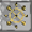

# Adaptability

<small>[TensuraMoreSkills](../../index.md) &rsaquo; [Abilities](../index.md) &rsaquo; [Unique Skills](index.md)</small>

| | |
|---|---|
| **Type** | Unique Skill |
| **ID** | `tensuramoreskills:adaptability` |
| **Modes** | 1 |
| **Activation** | Press |

> A unique skill that evolves through punishment.

## Modes

| # | Mode |
|---|---|
| 1 | Extermination Blade |

## How it works

- Activated by pressing the skill key
- Has a continuous (per-tick) effect

## Related

- **Items:** [Extermination Blade](../../items/weapons/extermination-blade.md)

## In-game messages

Show 3 messages

- ✦ Extermination Blade summoned.
- ✦ Extermination Blade dissipated.
- ✦ You adapted: Severance Immunity.

