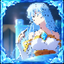

# Albis Vina

<small>[TensuraMoreSkills](../../index.md) &rsaquo; [Abilities](../index.md) &rsaquo; [Unique Skills](index.md)</small>

| | |
|---|---|
| **Type** | Unique Skill |
| **ID** | `tensuramoreskills:albis_vina` |
| **Modes** | 3 |
| **Activation** | Toggle, Press, Hold |

> I'm waiting for you, Will.

## Modes

| # | Mode |
|---|---|
| 1 | Ars Weiss |
| 2 | Riville Calantibium |
| 3 | Stellas Natea |

## Costs

| When | Magicule (MP) | Aura (AP) |
|---|---|---|
| Ars Weiss | *set by config (ars weiss cost mastered mastered, ars weiss cost otherwise)* |  |
| Riville Calantibium | *set by config (riville cost mastered mastered, riville cost otherwise)* |  |
| Stellas Natea | *set by config (stellas cost mastered mastered, stellas cost otherwise)* |  |
| other modes | 0 |  |

## How it works

- Can be toggled on and off
- Activated by pressing the skill key
- Charged or channelled by holding the skill key
- Triggers when the held key is released
- Triggers when you damage a target

## Obtaining

- Listed in the `grantedSkillIds` config option (config/tensuramoreskills-grand.toml): Skill IDs granted by Elfaria. Includes Albis so old Ars Weiss clones stay compatible, magic basics, transforms, senses, chant annulment,...

## Related

- **Effects:** [Diamond Dust](../../effects/albis-diamond-dust.md)
- **Summons / entities:** [Ars Weiss Body](../../mobs/ars-weiss-clone.md)

## In-game messages

Show 1 messages

- %s/%s

